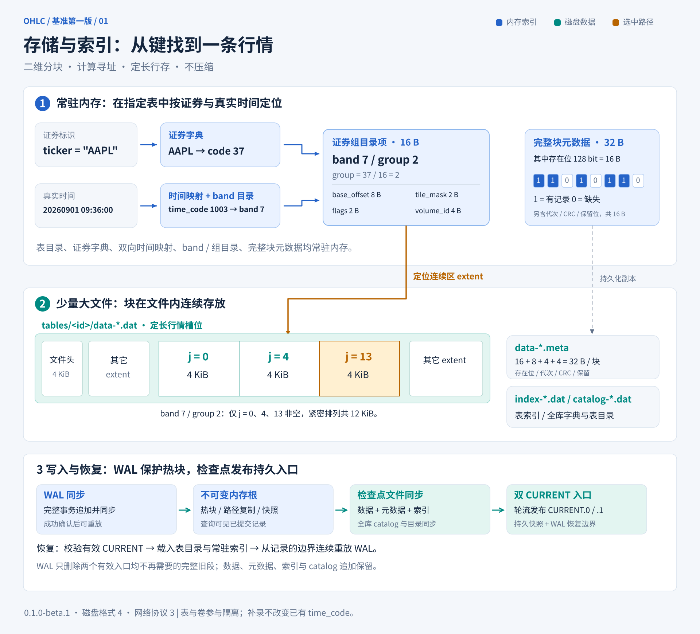
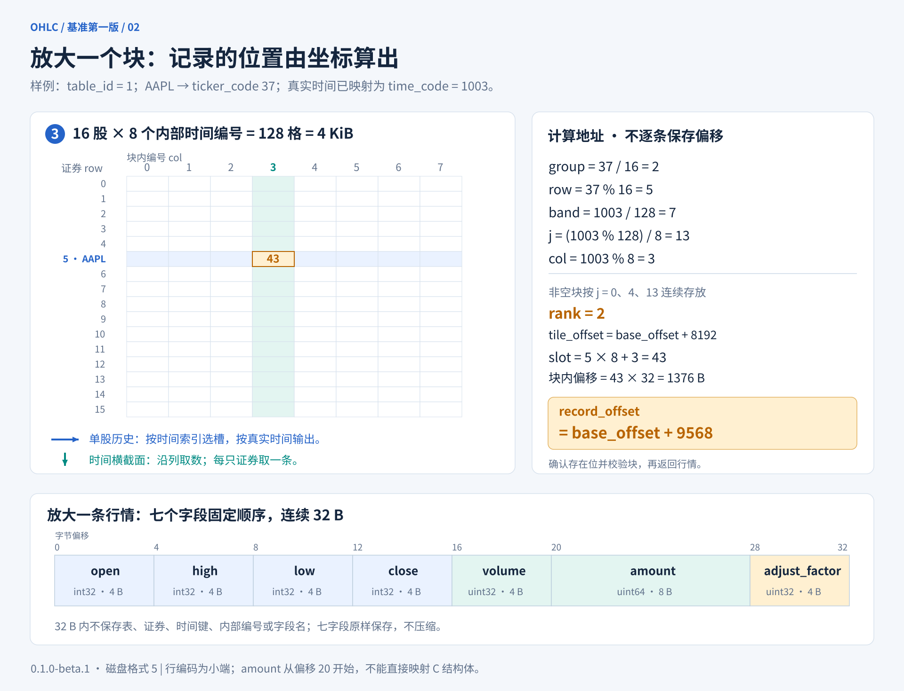

# ohlc 详细设计文档

版本：1.0（基准第一版）\
日期：2026-09-27\
软件基准：0.1.0-beta.1；磁盘格式 4 / 网络协议 3 / C ABI 1\
项目仓库：[cy-chengyan/ohlc](https://github.com/cy-chengyan/ohlc)\
许可证：Apache-2.0

本文是 ohlc 唯一的产品与技术设计文档，覆盖数据契约、物理布局、索引、读写、恢复、服务、客户端和验收要求。

**首版方案：二维分块 + 计算寻址 + 定长行存 + 不压缩。**

## 1. 目标与范围

ohlc 是专用于股票 OHLC 行情的存储系统，支持创建多张采用相同固定结构的表。核心采用纯 C17，正式运行环境为 Linux x86-64 和 ARM64。
系统提供嵌入式核心 `libohlc`、独立服务 `ohlcd`、C / Python / Java 客户端，以及交互式 shell 客户端 `ohlc`。

主要容量基准为一张包含 20,000 只股票、20 年分钟行情的表。系统同时支持 1 分钟、3 分钟、日线、5 个交易日等数据表。
所有表使用相同的七字段结构；使用者提供日期或日期时间以及已生成的行情，数据库自动建立内部坐标。
周期划分与行情聚合由调用方负责，不要求使用者管理内部周期编号。系统重点服务指定表内的两种查询：

```sql
SELECT * FROM bars_3m WHERE ticker = 'AAPL' AND datetime BETWEEN x AND y;
SELECT * FROM bars_3m WHERE datetime = x;
```

SQL 仅表达查询含义；实际接口为固定的二进制 API。表名由使用者指定，所有表的两类查询均返回全部七个行情字段。
单股范围包含短、中、长区间，没有预设的长度偏好。

写入支持实时批次、盘后批量导入和少量历史记录修正。记录以完整七字段覆盖。
单位、缩放精度、交易日历、周期的业务划分、行情聚合、行情质量、复权计算及业务数据版本由调用方负责。
客户端负责按表的时间约定解析输入，存储引擎负责真实时间到内部编号的映射。

首版聚焦单机存储、可创建的固定结构表、单表原子批次和一致查询；不包含数据库内分析计算、自动生成周期、业务历史版本查询、分布式复制与集群协调。

设计优先级依次为：

1. 数据与恢复语义正确，整数全范围无损。
2. 两类查询的定位和实际数据读取高效。
3. 实时写入延迟稳定，内存与后台任务有明确上限。
4. 源代码结构清晰，便于人类阅读、维护和排错。

## 2. 首版结构与默认参数

每张表的行情形成“证券 × 内部时间编号”的稀疏矩阵，使用固定尺寸二维块存放。块内采用证券优先行存；同一股票相邻内部编号的记录相邻。
真实日期时间先通过表级时间索引定位内部编号，再用整数计算定位固定槽位。

| 项目 | 首版设计值 |
|---|---:|
| 每条行情 | 32 B |
| 每块证券数 | 16 |
| 每块内部时间编号数 | 8 |
| 每块槽位数 | 128 |
| 数据块大小与对齐 | 4,096 B |
| 一个时间段 `band` | 128 个连续内部时间编号 |
| 同证券组、同 band 的块位置数 | 16 |
| 一个连续数据区 `extent` | 1–16 块，即 4–64 KiB |
| 块内顺序 | 证券优先，然后内部时间编号递增 |
| 行情编码 | 固定整数，小端，不压缩 |
| 主数据 | 每张表一份，两个查询方向共享 |
| 常驻定位结构 | 全库表目录、证券字典；每表时间映射、band 目录、证券组目录、完整块元数据 |

以上是基准第一版使用的固定参数，不表示所有硬件上的最优组合。参数写入数据库身份信息；同一数据库中固定一致，不能运行时任意改变记录含义。

时间粒度不改变块大小：3 分钟表与 5 日表均按 8 个内部编号组织一个块。编号仅为该表已经出现的不同时间分配。
按时间顺序首次导入时，相邻编号也对应相邻行情时间；补录新时间时保留已有编号，通过时间索引维护实际先后顺序。
同一时间的 20,000 只股票共享一条时间映射；时间映射不按股票记录重复保存。

系统处理的关键对象如下：

```text
表名 ──全库表目录──> table_id ──> 该表的时间映射、band 目录与卷集合
ticker 字符串 ──全库证券字典──> ticker_code
真实时间 ──表级时间索引──> time_code ──整数计算──> band、块位置、块内列
                             │
                       常驻 band 目录
                             │
                  band 内的证券组目录项
                       /             \
              已落盘连续数据区      已提交内存对象
                       \             /
                       4 KiB 行情块
                             │
                     存在位 + 计算偏移
                             │
                         32 B 行情
```

4 KiB 是文件格式定义的块大小。ARM64 Linux 的内核页大小可能为 4 KiB、16 KiB 或 64 KiB，不能把格式块、内核页和设备请求单位视为同一概念。
平台依据见 [Linux ARM64 启动规范](https://docs.kernel.org/arch/arm64/booting.html)。

## 3. 数据契约

### 3.1 七字段定长行

每条行情的磁盘载荷严格为 32 字节，字段顺序固定。

| 序号 | 字段 | 类型 | 字节偏移 | 字节数 |
|---:|---|---|---:|---:|
| 0 | open | int32_t | 0 | 4 |
| 1 | high | int32_t | 4 | 4 |
| 2 | low | int32_t | 8 | 4 |
| 3 | close | int32_t | 12 | 4 |
| 4 | volume | uint32_t | 16 | 4 |
| 5 | amount | uint64_t | 20 | 8 |
| 6 | adjust_factor | uint32_t | 28 | 4 |
| 合计 | | | | **32** |

所有表严格使用本节的字段、类型、顺序与偏移，不提供自定义字段或表级 schema。
字段名只用于接口说明和源码可读性，不进入每条记录。行情载荷中不包含表编号、ticker、时间键、内部时间编号、字段类型、长度或逐条指针。
所有字段均必填；数据类型的完整取值范围均有效。数据库不验证价格之间的市场业务关系。

**整数接口与整数存储共同构成精度边界：调用方负责精度、单位、缩放、舍入和数据转换，数据库原样保存并返回合法范围内的整数。**
该约定适用于七个行情字段的 API、SDK、shell 和批量导入；日期和日期时间的解析仍遵循第 3.2 节的独立契约。
引擎和客户端不替调用方解释小数含义，不自动选择或记录缩放倍率，也不隐式执行浮点转换、舍入或单位换算。

这样设计是为了避免在接口与存储之间引入二进制浮点表示误差，并让不同市场和数据源自行约定数值含义。
仅在底层保存整数，而在接口先接收浮点数再转换，不能保证进入存储前的小数精度。
整数契约保证声明范围内的值跨语言、传输和存储后仍可精确比较，不以整数运算一定快于浮点运算作为依据。

例如，调用方约定价格保留两位小数，自行将 `123.45` 转成 `12345` 后提交；数据库保存并返回 `12345`，
由调用方按同一约定还原显示为 `123.45`。倍率 `100` 仅为示例，不是内置默认值或新增的表元数据。
调用方须维护读写一致的单位和倍率、确定转换与舍入规则，并在转换和窄化时检查目标整数范围；
数据库不能恢复提交之前已经丢失的精度。

有符号整数按 32 位二进制补码编码；所有多字节整数使用小端字节序。
`amount` 位于偏移 20，不保证 8 字节对齐。实现使用安全的字节编解码或 `memcpy`，不能把文件缓冲区强转成自然对齐的 C 结构体。

自然对齐的 C 类型按 `sizeof` 分配内存；磁盘和网络长度按格式常量计算。两者不得混用。

### 3.2 表、证券、真实时间与内部编号

对使用者，主键为 `(table_name, ticker_id, datetime_or_date)`。
日期时间规范化后的逻辑键为 `(table_id, ticker_code, time_key)`；物理坐标使用 `(table_id, ticker_code, time_code)`。
查询、写入与导入必须确定一张表；相同证券和时间在不同表中互不覆盖。

- `table_id` 是数据库内稳定的 uint32 编号，从 1 开始分配。0 保留给全库对象；已提交编号不复用。
- `ticker_id` 是长度为 1–4096 字节的证券标识。按字节精确匹配，区分大小写，不去空格、不做 Unicode 归一化；前导零保留。常规文本客户端使用 UTF-8。
- `ticker_code` 为稳定的 uint32 编号，从 0 开始分配。一经提交不改变、不复用。证券字典由全库共享。
- `time_key` 是 uint32 的规范化真实时间键。分钟类表使用 POSIX Unix 分钟编号；日类表使用公历日期相对 1970-01-01 的天数。
- `time_code` 是引擎为某表中的不同 time_key 分配的 uint32 内部编号，从 0 开始，已提交编号不改变、不复用；用户不提供该编号。
- 表编号与证券编号只在同一个数据库 UUID 内有效；time_code 还必须绑定对应 table_id。
- 范围接口对真实 time_key 使用 `[start, end_exclusive)`。起点为 uint32，终点为 uint64，可取 `2^32`。
- `start == end_exclusive` 返回空结果；终点小于起点或大于 `2^32` 返回参数错误。闭区间调用方可使用 64 位运算把 `y` 转为 `y + 1`。

例如，在一个尚无数据的 3 分钟表中首次按顺序写入同一天的 09:30、09:33、09:36，
数据库可依次分配内部编号 0、1、2。任何股票的同一规范化时间均复用同一个编号。
之后补录 09:27，可以分配编号 3；已有编号保持稳定，范围查询仍按 09:27、09:30、09:33、09:36 返回。
不能假设 time_code 数值大小等于真实时间先后，也不能用插入顺序作为查询结果顺序。

分钟类输入以及时区规范化后的结果均须对齐整分钟；不自动舍入秒数，不把时间向表周期边界取整。
分钟类表中，未带时区的输入按建表时指定的时区解释，显式偏移输入转换为同一 UTC 分钟键。
夏令时导致的不存在本地时间返回错误；重复本地时间要求输入明确的偏移，不由客户端猜选。
日类表的日期表示调用方提供的交易日期或周期标记日期，不通过 UTC 午夜或本地时区反推。

表的周期描述不会触发聚合、交易日历推算、记录补齐或严格相邻时间间隔校验。
3 分钟表的停盘、跨日间隔，以及 5 日表按自然日或交易日分组后的标记日期，都由调用方的数据定义决定。
数据库保存输入指定的规范化真实时间，不需要预先知道休市表或未来交易日。

证券数量、表数量与每表已分配时间编号数量使用 uint64 计数，避免最后一个 uint32 编号对应的数量溢出。
time_key 或日期转换结果超出 uint32 范围时明确拒绝；内部编号耗尽时仅拒绝需要新时间点的写入，已有时间仍可更新。
对文件偏移、分配大小和记录数的乘加均进行溢出检查。

### 3.3 因子与缺失

调用方为每条行情提供适用的 `adjust_factor`；数据库原样保存，与另外六字段一起提交和返回。
因子不设默认值，不推算、不延续。修改因子通过完整行情覆盖完成。

缺失由独立存在位表示。零值、负价格、`UINT32_MAX` 和 `UINT64_MAX` 均不得用作缺失标记。
没有行情的时间不返回占位记录，也不补齐日历。全零的七字段记录仍是有效记录。

首版写接口不提供逐条删除。已有键可以覆盖，尚不存在的键可以插入。

### 3.4 创建表与固定元数据

用户可以创建多张表，包括采用相同周期但不同数据来源或业务定义的表。
所有表共享固定的七字段格式和块参数；建表不接受自定义列定义。

| 元数据 | 类型与约束 | 用途 |
|---|---|---|
| table_id | uint32，1…UINT32_MAX | 内部稳定标识 |
| name | 1–63 B ASCII，`[A-Za-z_][A-Za-z0-9_]*`，区分大小写 | 全库唯一表名 |
| period_unit | uint32，1=minute，2=day | 时间输入类型及周期说明的基本单位 |
| period_count | uint32，1…UINT32_MAX | 周期数量，例如 3m、5d 中的 3 与 5 |
| timezone | 0–255 B ASCII 时区名 | 分钟类表必填，使用 IANA 名称或 UTC；日类表为空 |
| description | 0–4096 B UTF-8 文本 | 可选的自然日/交易日、起止标记和数据来源说明 |
| created_seq | uint64 | 建表成功对应的提交序号 |

例如 period_unit=minute、period_count=3 表示 3 分钟行情；day、5 表示 5 日行情。
period_count 用于描述调用方提供的行情，不用于用除法猜测不规则交易周期的内部编号。
表名不参与时间解析；同样的 3 分钟定义可以创建多张不同名称的表。
调用方应通过说明或自身配置明确周期标记使用起始时间还是结束时间，并在同一张表中保持一致。

首版提供创建、按名打开、查看定义、分页列举和永久删除表；不提供改名、改字段或修改已提交表元数据。
创建需要写权限；同名表返回 `ALREADY_EXISTS`，不隐式打开已有表或覆盖其定义。
建表是独立的持久事务，成功后即可读到空表。打开表只查元数据，不隐式创建。
存活表数量受 max_tables 限制，默认 1,024；创建前检查资源预算。空表只占元数据，不分配行情块或大文件容量。

删除表需要写权限，目标是已解析的稳定 table_id。成功确认表示删除事务已经写入并同步 WAL，
新请求无法再打开、读取或写入该表。删除全部行情和表定义，不删除全库共享的证券字典。
删除前已开始的查询继续读取原快照；文件回收条件见第 13.4 节。删除不是可撤销操作，也不提供恢复已删表的接口。
允许同名重建，但分配新的递增 table_id；旧句柄只能得到 NOT_FOUND，不会误写到同名新表。
删除不存在的表返回 NOT_FOUND，不消耗提交序号。客户端不自动重试结果不确定的删除。
表页和文件句柄目录按已分配编号扩展，表页每页 256 项；已删除编号留下空项，资源仍计入引擎预算。
table_count 只统计存活表，分页跳过空项，编号分配另保存 last_table_id，达到 UINT32_MAX 后不再建表。

## 4. 二维分块与连续数据区



### 4.1 坐标分解

先取得指定表的上下文，并通过时间映射取得内部 time_code。给定证券编号 `c` 和内部编号 `t = time_code`：

```text
group = c / 16                 证券组编号
row   = c % 16                 块内证券位置，0…15
band  = t / 128                时间段编号
j     = (t % 128) / 8          band 内的块位置，0…15
col   = t % 8                  块内编号位置，0…7
slot  = row × 8 + col          块内记录槽位，0…127
```

这些除法和取余均使用常量，编译器可将其化为移位与掩码。代码优先表达清楚的坐标关系。

### 4.2 块内组织

```text
证券 0：编号 0，编号 1，……，编号 7
证券 1：编号 0，编号 1，……，编号 7
……
证券 15：编号 0，编号 1，……，编号 7
```

每个槽位 32 B。同一股票在块内占连续 256 B。
4 KiB 数据区只存放 128 个槽位；块头、存在位、校验和目录不插入槽位中。

整块没有有效记录时不分配数据块。部分为空时仍分配完整 4 KiB；未使用槽位写零，但是否存在只由位图决定。
固定槽位使地址计算与行情值无关，也意味着稀疏程度会影响空间占用。

### 4.3 同组、同时间段的连续区

同一张表中，同一个 `(band, group)` 最多存在 16 个块。落盘时将非空块按 `j` 递增连续保存，形成一个 extent。
extent 内没有间隔，不跨数据卷，长度为 `popcount(tile_mask) × 4096`。

证券组目录项为 16 B：

| 字段 | 类型 | 大小 | 含义 |
|---|---|---:|---|
| base_offset | uint64 | 8 B | extent 在数据卷中的字节起点 |
| tile_mask | uint16 | 2 B | 16 个时间位置的存在掩码 |
| flags | uint16 | 2 B | 对象类型；磁盘条目为 0 |
| volume_id | uint32 | 4 B | 数据卷编号 |

空目录项的 `tile_mask` 为 0，其余字段写零。有效偏移不落入数据卷头部。
一个 16 B 目录项最多覆盖 2,048 个行情槽位。



### 4.4 记录寻址

先验证 `tile_mask` 的第 `j` 位。如果存在：

```text
lower_mask   = (1u << j) - 1u
rank         = popcount(tile_mask & lower_mask)
tile_offset  = base_offset + rank × 4096
record_offset = tile_offset + slot × 32
```

`j == 0` 时 `lower_mask == 0`。位运算在足够宽的无符号类型上执行。
偏移运算先提升到 uint64，再检查卷边界；调用系统接口前检查是否能表示为有效 `off_t`。

取得存在位后，记录区间就是 `[record_offset, record_offset + 32)`。
“读取 32 B”描述有效载荷；冷读取通常取得完整块，不对每条记录发起一次系统调用。

## 5. 常驻索引与元数据

### 5.1 证券字典

完整字典常驻内存，包括字符串到编号的链式哈希桶、编号到条目的分页目录，以及不可变字符串条目。
每个请求只解析一次 ticker；批量接口和客户端缓存优先使用编号。

哈希桶数量为 2 的幂；条目数达到桶数的两倍时扩容并重挂链表。编号目录和字符串条目在提交准备阶段分配，
持久化成功后的字典发布不进行新的大额分配。字典互斥锁保护查找、扩容及发布。
编号和字符串映射持久化，并与数据库 UUID 绑定。字典增量只追加，不重新排序已分配编号。

数据库不推断上市或退市状态。证券停止写入后，字典条目和历史行情继续保留，
缺失时间不自动补零；新增证券取得新编号，不复用退市证券的编号。整组无新数据时不创建新块，
组内仍有证券写入时继续使用固定尺寸块，未写入的位置由存在位标记。容量按第 17 节计算。

### 5.2 内部编号的 band 目录

每张表有独立的 band 目录，按内部 time_code 而非真实时间编号寻址。`band` 为 25 位整数，采用三级稀疏数组树，按 8 / 9 / 8 位分解：

```text
level0 = band >> 17
level1 = (band >> 8) & 511
level2 = band & 255
```

节点只为有内容的分支分配，并保存孩子存在位图。
点查最多经过三级节点；读取任务按内部编号定位相关分支；真实时间范围的选择与排序由第 5.7 节时间映射负责。
该树的粒度是 band，不为每条行情创建节点。

### 5.3 band 内的证券组目录

每个 band 保存自己的组槽位数量。组目录按 group 直接寻址，内存中以每页 256 个 16 B 条目分页。
页大小为 4 KiB；更新时只复制发生变化的页及其上层指针。

尚未出现的组为空项。查询超出该 band 已有组槽位范围时返回缺失。
新增证券不扩展全部历史 band；仅在实际向某个 band 写入相应组时扩展该 band。

### 5.4 每块元数据与存在位

每个物理数据块对应一条 32 B 持久化元数据：

| 字段 | 大小 | 含义 |
|---|---:|---|
| presence | 16 B | 128 个槽位的存在位 |
| image_generation | 8 B | 本次物理块镜像的代次 |
| crc32c | 4 B | 数据、位图、代次与逻辑坐标的校验 |
| reserved | 4 B | 写零 |

`presence[row]` 是该股票 8 个内部时间编号的掩码，第 `col` 位对应相应记录。
第一版常驻内存保留全部已载入物理块槽位的完整 32 B 元数据，包括存在位、代次及校验。
不能仅按每块 16 B 的存在位估算实际常驻内存。

每个数据卷和元数据卷都有 4 KiB 文件头。给定数据偏移：

```text
physical_block = (tile_offset - 4096) / 4096
metadata_offset = 4096 + physical_block × 32
metadata_page = physical_block / 4096
metadata_in_page = (physical_block % 4096) × 32
```

内存元数据按 table_id、volume_id 和物理块号分段寻址，每个分配页保存 4,096 条完整元数据，共 128 KiB。
存在位位于每条元数据的前 16 B。块与元数据追加分配，第一版不复用物理槽位。

每个持久组页在 4,096 B 的 256 项目录编码之后附加 256 个 uint32 元数据校验值。
每项覆盖对应 extent 的全部 32 B 块元数据；组页记录自身另受 CRC 保护。
恢复先验证该校验，再信任存在位跳过缺失槽位；数据读取继续验证块、元数据和逻辑坐标。
内存组项保持 16 B，附加校验只进入持久索引。

### 5.5 已提交、未落盘的对象

内存目录可以使用有类型标识的临时句柄，指向一个热组对象；该句柄绝不写入持久目录。
热组保存至多 16 个块引用，并允许未变化的块继续引用其已落盘 backing extent。

被修改的块在内存中复制为新的 4 KiB 对象，附带新的存在位。已发布对象不可原地修改。
因此更新一条行情不要求立即复制完整 64 KiB extent，也无需等待一个块或 band 填满才可查询。

### 5.6 全库表目录

编号到不可变表描述的目录全部常驻内存。按表名打开时扫描常驻表目录，随后表句柄直接使用编号；
表名扫描不进入每条行情的读取路径。
已打开的客户端表句柄缓存数据库 UUID、table_id 和说明，热路径直接发送编号。

数据库读根保存每张表的时间映射根、反向时间数组、已分配编号计数器与 band 目录根。表根按每页 256 个引用组织，按 table_id 直接寻址；
只有建表或更新目标表时复制受影响的表根页，其他表的目录与块继续共享。
创建空表不为其预建全部证券组、时间映射页、band 树节点或存在位。

### 5.7 每表真实时间映射

每张表维护两种互相校验的结构，均常驻内存：

1. 按真实 time_key 排序的 B+ 树，叶项为 `(time_key:uint32, time_code:uint32)`。
2. 按 time_code 直接寻址的分页 uint32 数组，保存对应 time_key；另存 uint64 的已分配编号数量。

时间 B+ 树节点按 4 KiB 组织，精确查找为 O(log T)，返回 K 个时间项的范围扫描为 O(log T + K)。叶项 8 B，内部节点保存有序分隔键及子节点引用；
节点按明确编码持久化，内存对象不直接当作磁盘结构写出。节点头、引用、校验及页内余量计入实际容量。
采用路径复制保持快照不可变；范围游标通过所属根的遍历栈前进，不依赖跨版本的可变叶链。
反向数组按页分配与复制，已有编号对应的键不改变。
恢复时校验正反映射一一对应、编号小于计数器、真实时间键严格有序且唯一；冲突或越界作为损坏处理。

查一个真实时间时，先在 B+ 树中精确查找，再计算数据槽位；没有时间项时返回空结果。
查范围时，定位起点后按 time_key 有序扫描叶项，并把得到的 time_code 交给读取计划器。
连续内部编号组成可合并的读取段；乱序编号使用有界窗口排序 I/O、提取和重排输出，最终仍按真实时间返回。

写入准备阶段对同一批次的不同 time_key 去重；已有时间复用编号，新时间按键递增排序后从计数器尾部连续分配。
该分配基于提交协调器确定的基础根；重试准备时重新核对映射，不能并发给同一个时间发布两个编号。
时间项、反向数组、编号计数器和全部行情修改在同一个事务根中原子发布，失败批次不留下已发布的时间项。
WAL 重放采用相同的排序分配规则，并从检查点的编号计数器恢复，保证分配确定性。

首次按时间顺序导入能使内部编号与时间顺序一致。补录更早的新时间只增加时间索引项，不移动已有编号；
查询可能增加读取段，但保持正确排序。覆盖已有时间的行情不新增时间映射。
一个时间只注册一次，由该表所有证券共享；不会为每条股票行情建立一条时间索引。

## 6. 大文件组织

数据库维护全库目录和 WAL；每张表维护少量大数据卷、元数据卷和索引卷。
证券、时间点、块和 extent 都是文件内部结构，不按证券或日期建立文件。

```text
database/
  LOCK
  CURRENT.0
  CURRENT.1
  catalog-000001.dat
  wal-000001.log
  tables/
    00000001/
      data-000001.dat
      data-000001.meta
      index-000001.dat
    00000002/
      data-000001.dat
      data-000001.meta
      index-000001.dat
```

表目录名是 table_id 的固定 8 位小写十六进制表示，不直接使用用户表名。
数据卷及配套元数据卷、WAL 按配置容量轮换；catalog 和每表索引维持单个追加文件。
空表在第一次需要落盘时创建目录和卷。

- 表数据卷保存 4 KiB 块，默认每卷上限 1 TiB；不足一个 extent 的卷尾不用于拆分 extent。
- 表元数据卷按物理块号定长对应数据卷；表索引卷保存该表的真实时间 B+ 树、反向时间数组、编号计数器和 band 目录。
- 全库 catalog 卷保存证券字典、表描述、检查点表根与卷清单，使用带长度、类型、代次和校验的记录。
- WAL 按全库提交顺序追加，默认单段目标上限 1 GiB；一个事务帧不跨段。
- 两个 CURRENT 槽位保存全库一致检查点入口，固定各 4 KiB。

容量上限是轮换参数，不是启动时必须预分配的空间。WAL、目录、索引和数据卷均保持长期文件描述符，不按查询 open/close。
文件随追加写入增长，不依赖全卷预分配。第一版没有独立的全局文件描述符预算管理器；
部署者需结合表与卷数量设置进程上限，达到系统上限时操作返回 I/O 错误。

公共文件头包含文件类型标识、格式版本 4、数据库 UUID、table_id、卷编号、格式参数、创建代次和头部校验。
文件 magic 为 `OHLCFIL4`；catalog/索引记录 magic 为 `OIR4`。磁盘格式与网络协议分别编号，网络协议为 3。
第一版只读取格式 4；不支持的格式返回 `UNSUPPORTED`，不执行原地迁移。
全库 catalog 与 WAL 的 table_id 为 0；表卷必须匹配所属表。卷编号只在对应的表和文件类型内有效。
所有保留字节清零；未知版本和不一致参数明确拒绝打开。
新增表目录、卷或上层 tables 目录时，检查点发布前同步相应文件与必要的父目录项。

一个数据库只允许一个拥有写权限的进程打开，由 LOCK 排他保护。客户端通过服务共享该进程。
首版不允许另一个进程直接读取正在变化的数据库文件。

## 7. 单股历史范围查询

### 7.1 执行步骤

1. 获取一个一致读根，记录 snapshot_seq，并持有到查询结束。
2. 在该根中取得 table_id 对应的表根，并解析证券编号，计算 group 和 row；不存在的表或证券返回 `NOT_FOUND`。
3. 在真实时间 B+ 树中定位范围起点，借用当前叶节点中按 time_key 排序的连续映射区间；游标持有所属根，避免逐行复制遍历栈。
4. 将映射中的 time_code 转为 band、j、col，对实际时间顺序中连续属于同一块的项一次定位、检查存在位；跳过没有该股票行情的槽位。补录形成跳跃编号时重新定位，不能假设实际时间与内部编号同序。
5. 在有界计划窗口内合并连续编号、相同块和同 extent 的相邻读取，从热对象、缓存或磁盘取得数据。
6. 按计划中的真实时间次序输出对应记录；I/O 顺序可以调整，但输出顺序不能变。
7. 继续推进时间游标，直到范围结束；不返回空槽，不在读取前扫描统计完整结果。

返回记录携带规范化真实 time_key，不返回内部 time_code。
不同内部编号段可能访问同一个物理块；一个计划窗口内去重读取，跨窗口由有界块缓存复用。
单个股票缺失数据不会从全表时间索引中删除时间项，也不会改变其他证券的编号。

### 7.2 读取成本

对于块内编号偏移为 a、内部编号连续且都有目标股票行情的一段 L 条记录，L 大于零时：

```text
块数 = ceil((a + L) / 8)
块数据字节数 = 块数 × 4096
有效行情字节数 = L × 32
```

连续 390 个内部编号需要 49–50 块，即 196–200 KiB 块数据；有效载荷为 12,480 B。
内部编号连续的稠密长区间，其块读取量约为有效行情载荷的 16 倍；真实时间索引扫描、边界与缺失分布另计。
补录形成不连续编号时，对实际读取段分别核算并对重复块去重，不能直接把范围内的行数代入单段公式。

同一 extent 内可合并读取，最大 64 KiB。不同 band 的 extent 不保证物理相邻。
为了减少请求数而跨越未使用区域的预读，必须计入实际读取字节数。

## 8. 单时间横截面查询

### 8.1 执行步骤

1. 获取一致读根并取得表根，以真实 time_key 查找 time_code，再计算 band、j、col；时间不存在时返回空结果。
2. 定位一次该 band 的组目录，由查询快照维持其生命周期；随后按 group 递增扫描，不为每组重复遍历 band 树。
3. 跳过缺失的块，以及目标内部编号全部不存在的块。
4. 每组最多取得一个块，检查 16 只证券各自的目标内部编号存在位。
5. 批量调度磁盘读取，提取有效的 32 B 行情，输出相应 `ticker_code`。
6. 按证券编号递增返回，I/O 完成先后不改变结果顺序。

实现按有限数量的证券组形成调度窗口，窗口内并发读取并排序输出；不为全市场结果分配无界等待队列。
表存在但没有该时间的数据时返回成功的空结果；不存在的表返回 `NOT_FOUND`。

### 8.2 读取成本

在 20,000 只股票均存在的情况下：

```text
证券组数 = 20,000 / 16 = 1,250
需要的块数 = 1,250
块数据量 = 1,250 × 4,096 = 5,120,000 B
有效行情量 = 20,000 × 32 = 640,000 B
带返回键的结果量 = 20,000 × 36 = 720,000 B
```

1,250 是格式块数，不是固定的系统调用次数。各块可能位于不同 extent，不能假设它们组成一次连续读取。
缓冲 I/O、设备单位、预读和校验元数据可能增加实际读取量。

## 9. 缓存、I/O 与数据搬运

查询先访问已提交热对象，再访问有界的只读块缓存，最后进入文件 I/O。
缓存按 table_id、卷编号和物理块偏移定位，并核对 band、group 与块位置 j。
加载时验证块镜像代次及 CRC，之后借用已经校验的不可变数据。第一版不复用物理位置。

只读块缓存按固定大小内存池分配，采用分片索引和近似 CLOCK 淘汰。
缓存命中后固定缓存项并借用其已校验数据；只将目标槽位复制到结果缓冲，不再先复制完整块到游标。
每个游标最多持有 16 个块视图、256 条结果计划及 64 KiB 数据缓冲；换窗、取消或关闭时释放固定引用。
缓存项仍被借用或加载时不能淘汰。四路集合内没有可用项时使用游标缓冲完成读取，不等待其他查询释放容量。
缓存分片锁仅保护查找、加载登记、发布和引用计数；读取、CRC 校验和数据搬运不持有该锁。
同一块的并发未命中共享一次已登记的加载。窗口先完成自己负责的读取和发布，再等待其他窗口的加载，避免交叉等待。
近期热块、只读缓存及 I/O 缓冲计入全库引擎分配器；网络输出另设共享预算。第一版没有完整按表记账接口。
各表共享有界预算，不能为每张表重复配置一份完整内存预算；第一版不提供按表资源配额或公平调度保证。

首版文件访问使用显式偏移的 buffered I/O，默认由查询调用线程完成读取，合并同卷相邻区间。
查询执行层只依赖“批量提交区间、等待完成、取消”的接口，不能依赖共享文件游标。
当前查询窗口最多提交 16 个区间。相邻文件偏移及相邻目标缓冲合并为一个读取，单次最多 64 KiB。
`read_workers` 默认为 0：每个调用线程同步读取当前窗口的区间，不创建共享读线程，不经过读队列。不同查询仍在各自线程中并发执行。
显式配置为 1–16 时，多区间请求使用有界 POSIX 线程工作队列，全库最多排队 64 个区间；单区间仍在调用线程读取。线程数限定共享池，不包含调用线程的单区间读取。
服务参数为 `--read-workers`，未指定时直接使用 `ohlc_options_init()` 的引擎默认值，不再维护第二份服务端默认值。
完成顺序与结果顺序分离，每块仍独立核对 CRC 和逻辑归属；任意块出错时释放整个窗口的借用引用。
冷随机读取可按实测结果显式启用读线程池；不能假设并行化对热读也有收益。当前实现不自动探测页缓存状态，不依赖 io_uring。

应用块缓存和 Linux 页缓存可能包含重复数据，必须在整机内存预算中计入，不能把两者容量简单相加当作有效覆盖量。
首版不依赖直接 I/O 的对齐特性保证正确性；相关平台约束见 [Linux open 手册](https://man7.org/linux/man-pages/man2/open.2.html)。

数据块首次装入缓存时校验完整 4 KiB 数据与相关元数据。校验输入还包含期望的 table_id、band、group、j，避免错误目录指向另一个合法块而未被发现。
已校验且不可变的缓存对象不在每条记录读取时重复校验。

短读、短写和可重试中断按实际完成长度处理；意外 EOF、永久 I/O 错误和校验失败返回独立错误，不能伪装成无行情。

## 10. 写入与批量导入

### 10.1 字典注册和写入契约

首版写入请求指定 table_id，行记录按 `ticker_code` 与 `time_key` 编码。
调用方先创建或打开表、解析或注册证券，再提交包含编号的行情批次。
注册是独立的持久事务，返回稳定编号；后续行情批次失败不会撤销已成功的证券注册。
客户端可封装字符串接口，但必须向调用方保留建表、证券注册和行情写入各自的成功边界。

一个行情批次只写一张表；该批次中每个 `(ticker_code, time_key)` 只能出现一次，重复主键使整个批次在进入 WAL 前被拒绝。
批次引用的表必须已创建，证券必须已注册。不同批次可以覆盖同一表中的同一个键，以提交顺序确定最终值。
首版不提供跨表原子写入；调用方组织各周期表的数据生成及更新顺序。

### 10.2 提交步骤

提交协调器负责事务排序。无竞争时由调用线程取得执行权；有竞争时由唯一提交工作线程执行有界队列中的请求。

1. 检查请求长度、表编号、行数、证券编号、真实时间键、主键重复和资源预算。
2. 在协调器确定的顺序上取得基础根，为新时间确定内部编号，构造时间映射、块、位图和目录更新。
3. 完成 WAL 缓冲和发布阶段所需的全部内存分配，再确定提交序号并编码完整事务帧。
4. 追加 WAL。可将若干完整批次合并为一次同步组。
5. 对 WAL 执行 `fdatasync`，成功后推进持久提交边界。
6. 一次发布包含整个批次的内存根，再返回成功及提交序号。

同一同步组可一次发布包含组内全部批次的根；对读者不能暴露任一批次的中间状态。
组内准备根按提交顺序串行推进，后批次基于前批次的候选根分配新时间编号；不能让多个批次独立从同一旧计数器分配后直接合并。

行情无需等待满 8 个时间点或 128 个时间点。持久成功后的查询可以直接读取热对象。

### 10.3 实时写入成本

一张表在同一个时间写入 20,000 条行情：

| 内容 | 有效字节 |
|---|---:|
| 七字段行情 | 640,000 B |
| WAL 行记录，两项 uint32 键加行情 | 800,000 B |
| 更新 1,250 个块的数据复制上界 | 5,120,000 B |

以上未包含新时间的映射条目、事务头、校验、目录复制和分配器开销。同一时间一个批次最多复制上述数量的块；拆成大量小批次可能多次复制同一个块。
客户端应利用小批次聚合降低重复成本，批次等待时间由延迟预算控制。
服务端识别同一 time_key、ticker_code 严格递增的批次：线性核验后只解析一次时间映射，逐证券组构块，不创建逐行排序计划。
任意乱序输入仍走通用准备路径；重复主键、未知证券和资源不足保持整批拒绝语义。

一张表保存一个完整 128 个内部时间编号的全市场热窗口，纯块数据约为 81.92 MB。乱序写入可能同时涉及多个 band，必须受总脏数据预算约束。

### 10.4 刷写、修正与导入

后台将同一表、同一 `(band, group)` 的有效块整理为连续 extent，按块位置递增落盘。
当前按完整时间窗口推进、内存或 WAL 阈值以及时间上限触发快照检查点；触发后持久化完整快照。
写入与检查点均受工作内存限额约束，资源不足时返回 LIMIT，不允许无限扩大活跃时间窗口。
第一版按完整捕获快照检查点，不单独选择已离开活跃窗口的组；检查点触发与资源边界见第 14.7 节。

对已经落盘的行情修正，先在热对象中更新目标块，之后生成新的 extent。
一个 extent 最大 64 KiB，因此单条 32 B 修正的数据区落盘放大最坏为 2,048 倍，元数据与 WAL 另计。
同一 extent 的多次更新尽量合并到一次刷写。

盘后导入显式指定目标表，接受九列文本：`ticker, time, open, high, low, close, volume, amount, adjust_factor`。
time 列使用该表的日期或日期时间语法；导入器转换为真实 time_key。表编号放在导入上下文中，不在每行重复。
使用者不提供内部 time_code；导入器也不能用文件行号代替时间键。
整数解析必须检查范围，不经过浮点数。导入器先准备字典，再按内存预算组织事务批次。
初次导入优先按真实时间排序，以提高新编号的时间局部性；取得映射后按证券组构块与刷写。
引擎识别“真实时间严格递增、每个时间具有相同连续证券编号区间”的矩形批次：完整线性校验输入，
每个不同时间只保存一个 uint32 内部编号，再按证券组遍历时间构块，跳过两次逐行排序。
证券区间可从组内任意位置开始、在任意位置结束；已有时间继续复用原编号，跨 band 或块时重新取得可写对象。
不满足矩形条件的批次仍走通用路径；单时间有序批次使用第 10.3 节的独立路径。
这属于自动识别的内部优化，不要求调用方声明排序保证；未知证券、重复键或资源不足仍使整个批次失败。
外部排序与批次临时空间单独预算。

导入事务使用相同持久性要求。一个大文件由多个原子批次组成，不承诺整个文件为单个事务。
导入结果记录已确认的批次及输入位置；未确认的最后批次必须按不确定结果处理。

### 10.5 提交执行权与同步组

每个数据库有一个行情提交工作线程，队列最多容纳 64 个请求。
队列为空且没有执行者时，调用线程取得执行权并直接完成提交；否则请求排队，队列满返回 `BUSY`。
调用线程与工作线程共享唯一执行权，已排队请求按 FIFO 选择，不能被新请求越过。
I/O 不持有队列互斥锁；完成或失败均释放执行权并通知等待者。

工作线程自然合并已经排队的请求，每组最多 16 个批次、总帧预算不超过 16 MiB，不设置固定攒批等待。
每个批次独立校验和分配，合格批次按前一候选根推进；一个批次准备失败不使其他合格批次失效。
同组 WAL 同步成功后发布最终根并唤醒调用方；已追加但同步失败的批次返回 `OUTCOME_UNKNOWN`。
跨 WAL 段时先同步旧段，再建立并同步新段及目录，最后同步当前段。
分组同步不提供跨批次原子性；未确认批次在恢复后可能只保留连续前缀。
证券注册和建表独立取得提交锁与同步，共享全库提交序号。

## 11. 并发与一致性

### 11.1 读根与对象生命周期

每个查询取得并持有一个不可变数据库根；根包含提交序号、证券字典视图、表目录视图和各表的真实时间映射、反向数组及 band 目录根。
同一查询的全部返回行属于同一个根，即使期间有写入和刷写，也不混入新的记录版本。

根的引用获取和发布通过一把短时同步锁完成。查询取得引用后立即释放该锁，后续定位、I/O 和网络传输不持有它。
后台持久化可能为共享索引对象填写磁盘定位缓存；这些 `disk_offset` 字段以原子变量发布，不改变快照的键、子节点或行情内容。
根持有子对象引用；共享子对象使用引用计数和明确的归属机制。最后引用释放后，
对象在执行释放的线程中回收；第一版没有独立后台回收器，释放较大旧快照可能增加该次操作耗时。

写者通过路径复制构造新的目录，只复制目标表根页、变化的索引节点、组页和数据块。
更新不修改任何已经对读者发布的数据字节或存在位。

### 11.2 两种发布

事务发布改变数据语义，推进提交序号。
刷写发布仅将等价的热对象替换为已落盘表示，不改变查询所见的值和提交序号。

刷写完成时必须核对目标对象代次。期间若产生新修改，不得把较早的块覆盖到当前目录中。
较早块仍可作为对应检查点的数据，当前较新的热对象继续由 WAL 和后续检查点保护。

### 11.3 资源限制

每个查询设置输出窗口、I/O 数量和最长持有时间；服务设置总查询数量、表数量及总保留对象预算。
慢客户端可能延长根和物理 extent 的寿命。达到限制时取消请求或背压，不把无限保留作为正确性前提。
取消后须等在途 I/O 和缓冲引用释放，才能真正回收对象。

## 12. WAL 与成功确认

### 12.1 WAL 内容

WAL 保存逻辑事务，不保存进程指针。事务类型包括证券注册、单表行情批次、创建表和删除表。
行情行记录为 `ticker_code:uint32 + time_key:uint32 + 七字段32B`，固定 40 B。
目标 table_id 只写在事务头中，不增加每条行情的 WAL 行长度。time_key 是真实时间键；内部 time_code 由确定性的映射分配规则恢复。

事务帧使用 64 B 头部、载荷、补齐到 8 字节边界的零填充及 32 B 尾部。
头部布局如下：

| 偏移 | 类型 | 含义 |
|---:|---|---|
| 0 | byte[8] | magic，`OHLCWTX4` |
| 8 | uint16 | version = 4 |
| 10 | uint16 | type：1=证券注册，2=行情批次，3=创建表，4=删除表 |
| 12 | uint32 | flags，首版为 0 |
| 16 | uint64 | frame_bytes，包含头部、填充和尾部 |
| 24 | uint64 | commit_seq，从 1 开始 |
| 32 | uint32 | item_count |
| 36 | uint32 | table_id；证券注册时为 0，其他事务为目标或新建表编号 |
| 40 | uint64 | payload_bytes，不含填充 |
| 48 | uint32 | header_crc32c，计算时本字段置零 |
| 52 | byte[12] | reserved，写零 |

尾部依次为 `magic[8] = OHLCEND4`、`frame_bytes:uint64`、`commit_seq:uint64`、`frame_crc32c:uint32`、`reserved:uint32`。
整帧校验覆盖头部、载荷、填充及尾部，计算时仅将尾部的 frame_crc32c 置零。
头尾长度与序号必须一致，填充及保留字节必须为零。

行情载荷为 `item_count × 40 B`；证券注册事务的 item_count 为 1，载荷为 `code:uint32 + ticker_length:uint32 + ticker 字节`。
建表事务的 item_count 为 1，载荷依次为长度前缀 name、period_unit:uint32、period_count:uint32、长度前缀 timezone、长度前缀 description；其 commit_seq 即 created_seq。
删表事务的 item_count 为 1、payload_bytes 为 0，事务头的 table_id 指定被删除的现存表。
重放删除后不能再对该编号应用写入，后续同名建表必须使用新编号。
恢复时建表必须先于该表的行情事务；表编号、名称或目标表状态不一致属于损坏，不能隐式创建缺失表。
帧大小上限为 16 MiB，恢复先验证固定头部及长度上限，再读取或分配载荷。
只有完整、校验正确、序号连续的事务帧才参与恢复。

WAL 卷头保存数据库 UUID、卷编号及起始序号。事务不能跨卷；轮换新建文件后，完成卷头及目录项同步，才确认该卷中的事务。
进入 WAL 前被拒绝的请求不消耗提交序号。WAL 尾部出现写入失败时终止该追加序列，完成恢复处理后再接受写入。

### 12.2 成功与不确定结果

只有 WAL 已持久化且内存根已经发布，服务才能返回成功。一次成功写入对随后取得的新读根可见。

若连接在写请求传输开始后断开，客户端无法仅凭断开判断事务是否提交，返回 `OUTCOME_UNKNOWN`。
请求编号只关联响应，不提供持久幂等去重。客户端不得自动重试不确定写入。

WAL 同步失败时停止继续确认写入，保存错误并进入需要恢复检查的状态。不能在相同不确定尾部之后直接追加并继续服务写请求。

文件同步与父目录同步是不同步骤。新建、替换和轮换文件时必须处理目录项持久化。
平台依据见 [Linux fsync/fdatasync 手册](https://man7.org/linux/man-pages/man2/fsync.2.html)。

## 13. 检查点、恢复与空间回收

### 13.1 检查点生成

1. 在提交锁内同时捕获提交序号为 S 的一致根、当前 WAL 段编号和该段追加末尾偏移；偏移恰好位于 S 的完整帧之后。持有根引用后释放提交锁，后续事务可以继续提交。
2. 为该根中尚未持久化的对象分配新 extent，写入数据及配套元数据。
3. 将截至快照证券数量的字典、表描述与检查点表根写入全库 catalog 卷，将各表持久目录写入对应索引卷，保存必要的校验与引用。
4. 检查点所有者为实际追加过的数据/元数据卷及索引卷维护 dirty 标记，只同步这些文件；catalog 和 CURRENT 仍按发布协议同步。新建文件及目录还要同步必要的父目录。dirty 标记仅由检查点所有者维护，成功同步后清除。
5. 构造新的 CURRENT 记录，包含检查点代次、S、全库表目录根、证券字典根、全部表的卷清单入口和恢复所需 WAL 边界。
6. 写入两个 CURRENT 槽位中较早的那个并同步。完成后才将其计为有效检查点。

CURRENT 记录包含整页校验。写入时不依赖 4 KiB 覆盖天然原子；另一槽位继续保留可恢复入口。
数据和目录未持久化之前，禁止发布引用它们的 CURRENT。
同一次检查点按需分配并复用一个 64 KiB 刷写缓冲区；不会为每个证券组重复申请临时块缓冲。
当前仍将变化组的全部已分配块写入新 extent；未变化的组及持久索引节点继续复用引用。
检查点的重写单位是组的 extent，少量历史修正也可能重写同组未变化的块。

格式 v4 的 CURRENT 固定 4,096 B，全部整数小端：

| 偏移 | 类型 | 含义 |
|---:|---|---|
| 0 | byte[8] | `OHLCUR4` 加一个零字节 |
| 8 | uint32 | version = 4 |
| 12 | uint32 | reserved，0 |
| 16 | byte[16] | 数据库 UUID |
| 32 | uint64 | 非零检查点代次 |
| 40 | uint64 | 已覆盖的提交序号 S |
| 48 | uint64 | catalog 根记录偏移，间接引用字典和全部表根 |
| 56 | uint32 | 恢复开始的 WAL 段编号 |
| 60 | uint32 | reserved，0 |
| 64 | uint64 | 该段内恢复偏移，至少 4,096 且按 8 B 对齐 |
| 72 | byte[4020] | reserved，全部为 0 |
| 4092 | uint32 | 整页 CRC32C，计算时本字段置零 |

### 13.2 两个持久入口的保留规则

设两个有效 CURRENT 保存的恢复段编号分别为 W0 和 W1。
保留从 `min(W0, W1)` 开始的全部 WAL 段，包含边界段自身；不截断边界段中的已覆盖前缀。
较早入口仍能从其段内偏移重放到最新提交。WAL 不能按单个最新检查点或当前活动段直接删除。
两个入口引用的 extent、索引记录、表描述和证券字典对象都属于保留对象。

只有一个有效入口时，按该入口保留。初始化时生成提交序号为 0、证券字典与表目录均为空的完整空库检查点，不自动创建默认表。
保留边界更新和删除操作由检查点所有者串行执行：CURRENT 文件及目录同步完成后，
才逐个删除小于保留段编号的文件，再同步数据库目录。恢复成功后也执行同样的清理。
删除或目录同步失败时进入失败状态并停止确认写入；中途进程退出可能留下多余旧段，重开可继续清理，
不会删除两个持久入口所需的重放范围。查询快照不读取 WAL，因此活跃读者不会阻止已覆盖 WAL 的整段清理。

### 13.3 启动恢复

1. 取得排他锁，读取数据库身份并校验两个 CURRENT。
2. 从较新有效入口开始，验证其必需的目录、字典、卷身份和文件边界；必要时尝试另一个有效入口。
3. 载入全库证券字典和表目录，再载入各表真实时间索引、反向数组、编号计数器、band 目录、组目录与完整块元数据，重建内存对象并检查卷归属。
4. 校验所选入口的 WAL 段头、UUID、文件长度和恢复偏移，直接从该偏移重放；第一帧必须为 S+1，后续段和帧必须连续。缺失必需段或文件短于恢复偏移属于损坏。
5. 重放范围中未形成完整事务的最后文件尾部片段不参与重放；已完整成帧但校验失败、序号断裂或中部损坏必须报错，不跳过继续。已覆盖的 WAL 前缀不再扫描或校验，其恢复依据为持久检查点。
6. 建立可服务根，按两个有效入口的边界清理旧 WAL，确认恢复状态后才开放客户端连接。

崩溃前未收到成功响应的完整事务可能在恢复后存在，这是不确定结果的正常语义。
发现持久对象损坏时不自动删除记录或返回缺失；如果保留入口与 WAL 无法完成恢复，停止开放数据库。
行情块的数据校验在首次实际读取时完成；启动恢复并不意味着已经扫描验证全部行情字节。

### 13.4 物理空间与保留

存活表的数据、元数据、表索引和全库 catalog 采用追加写入。第一版不回收或复用存活表已经分配的 extent，
也不删除其孤立数据卷，因此运行占用可能大于当前有效行情的容量模型。
双 CURRENT 与活跃查询可以引用不同镜像；追加保留保证这些引用的物理位置稳定。

整表删除采用延后回收：两个持久 CURRENT 都覆盖删除提交后，并且没有存活查询游标时，
检查点所有者移除该表目录中的规范数据卷、元数据卷和索引文件，同步目录，关闭句柄并清除缓存项。
实现保守地等待全库游标归零；其他表的长查询也可能延迟物理回收。删除确认不等待这一步，
也不承诺安全擦除磁盘内容。历史 catalog、未回收 WAL 和已有备份不由删表命令重写。
服务后台为待回收表推进必要的两个检查点，之后重试回收；嵌入式调用方仍须自行安排检查点。
清理失败保留待回收项并报告错误，不撤销已经提交的删除，也不把旧表重新发布为可见表。
重启后扫描已分配但不在恢复读根中的规范表目录，将恢复提交序号作为保守回收边界。

catalog 根载荷的前 32 B 依次为提交序号:uint64、证券数量:uint64、字典尾偏移:uint64、
存活表数量:uint32、表编号高水位:uint32；随后仅保存存活表描述，按 table_id 严格递增。
高水位字段为 0 时沿用未删表库的连续编号编码，最大表号等于存活表数量；非零时保存 last_table_id。
现有 beta 数据库可直接读取。发生删表后，稀疏 catalog 和 WAL 类型 4 需要本版本或更新版本，
不支持降级到不认识删表的旧程序；旧程序必须拒绝这些记录，不能跳过删除事务。

WAL 的回收只按第 13.2 节执行安全整段删除，不截断仍需要的段内前缀。
离线备份复制全部规范文件，不过滤不可达镜像，不改变物理布局，也不实现空间整理。

### 13.5 故障处理边界

| 故障位置 | 可恢复状态及处理 |
|---|---|
| WAL 事务未完整写入 | 不包含该事务的已提交前缀；尾部残片不重放 |
| WAL 完整，响应尚未到达 | 事务可能恢复，调用方得到不确定结果 |
| WAL 同步或数据同步报错 | 停止相关写确认，保留材料并检查恢复 |
| 数据已写，CURRENT 未发布 | 使用已有入口与 WAL；未引用 extent 保留在追加文件中 |
| 写 CURRENT 时中断 | 校验两个槽位，从有效入口恢复 |
| 数据或索引校验失败 | 明确报告损坏；不得作为无记录处理 |
| 磁盘空间不足 | 在可行时先背压；失败事务不返回成功 |

上述为设计要求，须通过必要的崩溃点验证后才能作为实现保证。

## 14. 服务与二进制协议

### 14.1 连接模型

`ohlcd` 使用 TCP 长连接和同机 Unix domain socket。每条连接同时处理一个请求，客户端连接池提供并发。
网络层、查询工作队列、提交协调器和检查点线程分离，慢连接不得阻塞全局提交。

默认监听本机。回环和远程 TCP 监听均支持可选令牌、可选 TLS，两者独立配置。
配置令牌后按只读、读写权限认证；两种令牌文件均未配置时，客户端不携带令牌，获得读写权限。
普通 TCP 不加密数据和传输的令牌；需要传输加密时配置 TLS。
TLS 传输层不改变核心数据库的 C17 数据格式。

| 令牌文件 | TLS 证书与私钥 | 连接方式 |
|---|---|---|
| 未配置 | 未配置 | 普通 TCP，匿名读写 |
| 已配置 | 未配置 | 普通 TCP，按令牌授权 |
| 未配置 | 已配置 | TLS，匿名读写 |
| 已配置 | 已配置 | TLS，按令牌授权 |

### 14.2 帧头

协议版本为 3，独立于磁盘格式版本 4；所有整数小端。固定帧头 32 B：

| 偏移 | 类型 | 含义 |
|---:|---|---|
| 0 | uint32 | magic，ASCII `OHLC` |
| 4 | uint16 | version = 3 |
| 6 | uint16 | opcode |
| 8 | uint32 | flags：RESPONSE=1，FINAL=2 |
| 12 | uint32 | body_length |
| 16 | uint64 | 非零 request_id |
| 24 | uint32 | status |
| 28 | uint32 | chunk_sequence，从 0 开始 |

请求的 flags、status、chunk_sequence 为 0。响应设置 RESPONSE，最后一帧另设 FINAL。
未知标志、非法长度、请求编号或序列不匹配均为协议错误。单帧载荷上限默认 16 MiB。

错误响应为 FINAL，携带非零状态码且没有行情载荷。查询若已经返回部分数据，之后发生错误，则整个查询仍未成功完成。
在 FINAL 前 EOF 也视为未完成，客户端不能把部分结果当成完整结果。

### 14.3 操作

| opcode | 操作 | 请求主体 | 成功响应主体 |
|---:|---|---|---|
| 1 | HELLO | 长度前缀凭据 | UUID、帧上限、写入行数上限、查询期限、能力位 |
| 2 | PING | 空 | 空 |
| 3 | RESOLVE | 长度前缀 ticker | ticker_code:uint32 |
| 4 | DICTIONARY | start_code:uint32、limit:uint32 | 快照序号、条目数、编号与字符串列表 |
| 5 | SERIES | table_id:uint32、code:uint32、start:uint32、end_exclusive:uint64 | 行情结果分块 |
| 6 | CROSS | table_id:uint32、time_key:uint32 | 行情结果分块 |
| 7 | REGISTER | 长度前缀 ticker | code:uint32、commit_seq:uint64 |
| 8 | WRITE | table_id:uint32、count:uint32、count 条 40 B 写入记录 | commit_seq:uint64 |
| 9 | TABLE_CREATE | name、period_unit、period_count、timezone、description，编码同建表 WAL 载荷 | table_id:uint32、commit_seq:uint64 |
| 10 | TABLE_OPEN | 长度前缀 name | 表描述 |
| 11 | TABLE_LIST | start_id:uint32、limit:uint32 | snapshot_seq:uint64、count:uint32、表描述列表 |
| 12 | STATS | 空 | 11 项 uint64 运维计数，见第 22.4 节 |
| 13 | CHECKPOINT | 空 | 空；需要写权限 |
| 14 | TABLE_DROP | table_id:uint32 | commit_seq:uint64；需要写权限 |

字符串使用 uint32 字节长度前缀，不依赖 NUL 终止。HELLO 必须为第一个请求。
HELLO 响应为 UUID 的 16 B 加四项 uint32，分别表示后四项参数。
DICTIONARY 响应开头为 `snapshot_seq:uint64 + count:uint32`，随后每项为 `code:uint32 + 字符串`；编号稳定，分页之间新增证券不改变已有条目。
同一个已注册 ticker 再次 REGISTER 返回原编号，不创建新编号。

表描述编码为 `table_id:uint32 + created_seq:uint64`，随后是建表 WAL 载荷中相同顺序的全部定义字段。
所有字符串均使用 uint32 字节长度前缀。客户端打开表时取得周期单位、时区与固定定义。
TABLE_OPEN 只读取，不创建；TABLE_CREATE 和 TABLE_DROP 需要写权限。TABLE_LIST 的 limit 范围为 1–256，默认客户端使用 128。
TABLE_DROP 只删除指定编号，返回后允许同名重建；旧编号不会复用。
表列表按编号递增，start_id 为包含起点，0 等价于 1；分页之间新建表不改变已有表的编号或内容。
分页到 UINT32_MAX 后直接结束，禁止加一回绕。表、证券分页均受响应帧大小限制。

写入记录为 `ticker_code:uint32 + time_key:uint32 + 七字段32B`。
默认单批最多 250,000 行，还必须满足协商后的帧大小和服务资源预算。

### 14.4 查询返回

每个结果分块以 32 B 信息开头：

```text
snapshot_seq:uint64
emitted_rows:uint64     包括本分块在内的累计行数
chunk_rows:uint32
kind:uint32             1=SERIES，2=CROSS
table_id:uint32
reserved:uint32         写零
```

其后是 `chunk_rows` 条 36 B 结果记录：`key:uint32 + 七字段32B`。
SERIES 的 key 是规范化真实 time_key，CROSS 的 key 是证券编号。一个分块默认最多 16,384 行。
同一请求的快照序号、table_id 和 kind 固定，table_id 必须与请求一致，累计行数必须等于已收到行数之和。
成功 FINAL 中的累计行数就是总行数；空结果发送一个成功 FINAL，行数为零。

这种返回方式允许读取与传输按有界窗口推进。完整收集为数组由客户端显式选择，并受到其总结果内存预算限制。

### 14.5 错误分类

| 状态码 | 名称 | 含义 |
|---:|---|---|
| 0 | OK | 成功 |
| 1 | INVALID | 参数、类型范围或重复主键错误 |
| 2 | NOT_FOUND | 未找到记录 |
| 3 | LIMIT | 请求或资源上限 |
| 4 | BUSY | 当前背压或暂不能接收 |
| 5 | IO | I/O 失败 |
| 6 | CORRUPT | 持久数据校验失败 |
| 7 | UNSUPPORTED | 格式、协议或能力不支持 |
| 8 | UNAUTHORIZED | 身份或权限不足 |
| 9 | OUTCOME_UNKNOWN | 写入结果不确定 |
| 10 | CANCELLED | 查询取消或超过期限 |
| 11 | ALREADY_EXISTS | 创建的表名已经存在 |

如果服务无法证明写事务未提交，应返回不确定结果，不能让调用方把一般 I/O 错误误解为安全重试许可。

### 14.6 服务配置文件

`ohlcd --config <文件>` 显式读取一个 UTF-8 / ASCII `key=value` 文件；不自动搜索用户目录或系统目录。
优先级固定为 **命令行 > 配置文件 > 内置默认值**，与 `--config` 在命令行中的位置无关。
配置文件只在启动时读取，修改后重启生效；不提供热重载。版本化模板为 `examples/ohlcd.conf`，
安装到 `<prefix>/share/ohlc/ohlcd.conf`，部署方复制到自己的配置目录并设置数据路径。

语法规则：键区分大小写；忽略空行、行首空白后的 `#` / `;` 注释；去掉键和值两端空白。
需要保留首尾空白的值用双引号包围，双引号内不转义、不展开环境变量、不加载其他文件。
不接受行尾注释。单行最多 8,191 字节，不含换行；拒绝 NUL。
未知键、重复键、缺少等号、引号未闭合、空值及越界数值均拒绝启动，文件内错误报告路径与行号。
文件中的每个值都必须合法，即使稍后会被命令行覆盖；跨参数约束在应用全部覆盖后校验。
同一命令行选项重复时采用最后一个值；同次启动最多指定一个 `--config`。

| 配置键 / 同名长选项 | 服务默认值 | 含义及有效范围 |
|---|---|---|
| `data` | 必填 | 数据库目录；不存在时创建 |
| `host`、`port` | `127.0.0.1`、`8765` | 数值 IP、1–65,535 端口 |
| `socket` | 未启用 | Unix socket；与显式设置的 host / port 互斥 |
| `memory-mib` | 1,024 | 引擎分配预算，1–1,048,576 MiB |
| `cache-mib` | 64 | 块缓存，0–524,288 MiB，且不超过 memory-mib 的一半 |
| `network-mib` | 128 | 网络缓冲共享预算，1–1,048,576 MiB |
| `connections` | 64 | 连接上限，1–1,024 |
| `max-tables` | 1,024 | 表数量上限，1–1,048,576 |
| `max-cursors` | 256 | 全库同时存活的查询游标上限，1–1,048,576 |
| `timeout-ms`、`query-ms` | 各 30,000 | 握手与请求 I/O 超时、完整查询期限，各 1–3,600,000 ms；不限制已认证连接的空闲等待 |
| `read-workers` | 0 | 0 在调用线程读盘；1–16 启用共享读取线程池 |
| `wal-mib` | 1,024 | WAL 段轮换目标，16–1,048,576 MiB |
| `data-volume-mib` | 1,048,576 | 行情卷轮换目标，1–1,048,576 MiB |
| `tls-cert`、`tls-key` | 未启用 | TLS 证书链和私钥路径，须成对设置；均未设置时使用普通 TCP，不用于 Unix socket |
| `read-token-file`、`write-token-file` | 未启用 | 可选的只读、读写凭据文件路径；均未配置时匿名读写，配置中不放令牌正文 |

MiB 为 1,048,576 B。卷和 WAL 大小是轮换目标，不会在启动时预分配对应空间。
所有相对路径以**进程工作目录**为基准，服务部署推荐使用绝对路径。
配置文件与命令行共同遵守相同的 TLS、认证、缓存和端点互斥条件。
模板默认包含 host / port；改用 socket 时须移除这两个键。

`--check-config` 校验最终参数、凭据文件权限与内容、TLS 证书和私钥及监听地址，成功退出 0，失败退出 2。
检查过程不创建或打开数据库，不绑定端口，不创建 socket；不验证已有库内容、磁盘容量、目录写权限或端口是否被占用。
服务启动时仍会执行实际资源获取，可能因这些运行条件失败。该配置文件只供 `ohlcd` 使用；
嵌入式调用方通过各语言的 options 对象指定引擎预算。

### 14.7 服务执行与检查点调度

协议能力位为 `READ=1`、`WRITE=2`，读写连接返回 3。字典和表列表分页上限均为 256；普通客户端每页默认 128。
查询每块最多 16,384 行；服务当前在数据块之后发送一个零行成功 FINAL，客户端必须继续读取该结束帧。
查询期间快照不变，客户端核对操作码、请求号、帧顺序、表/查询类型、快照号、累计行数以及键顺序；未完成结果明确失败。

当前每条已接入连接由一个独立线程处理。连接数默认 64、上限 1,024；网络缓冲共享限额默认 128 MiB；I/O 超时与查询期限默认各 30 秒。
完成 HELLO 的连接空闲时继续等待下一条命令，不把用户输入耗时算入请求期限。
收到下一次网络输入或存在 TLS 内部缓冲后开始计算请求 I/O 时限；不完整的帧头、载荷仍会超时关闭。
握手和未完成 HELLO 的连接同样保留有限期限。服务停止时 shutdown 唤醒空闲连接，不能无限等待退出。
TCP 启用 SO_KEEPALIVE，在支持的平台配置空闲 60 秒后探测、间隔 15 秒、最多 4 次；
keepalive 用于发现失联对端，不重放业务请求。空闲连接仍占用连接数和缓冲预算。
这些参数可通过 `--connections`、`--network-mib`、`--timeout-ms`、`--query-ms` 配置。
网络缓冲预算与引擎 `--memory-mib`、`--cache-mib` 分开；`--cache-mib 0` 关闭应用块缓存，默认仍为 64 MiB。
线程栈、OpenSSL 与系统分配器开销不计入这两项，应计入进程容量规划。
慢客户端只占用自身连接和有界缓冲，数据发送不持有全局提交锁。连接耗尽时新连接被关闭；缓冲不足时请求被拒绝或连接关闭，写入调用按是否已发送保持不确定结果语义。

检查点线程每 100 ms 检查状态；有新提交且满足以下任一条件时发起检查点：任一表跨过一个完整的 128 时间编号窗口、检查点快照之后新增 WAL 达到 64 MiB、分配器计账超过限额一半，或距上次完成检查点达到 300 秒。
这是按活跃窗口推进决定检查点时机；触发后仍持久化完整的捕获快照，不是按表或按组分别推进恢复边界。稀疏到达、历史修正和压力触发仍可能刷写部分 extent。
显式 `ohlc_checkpoint()` 与正常停机强制执行检查点，不受上述触发阈值限制。
检查点通过独立互斥锁串行，短暂持有提交锁固定已提交根与 WAL 计数边界，随后在提交锁外写数据、索引、catalog 和 CURRENT。
CURRENT 持久后，在提交锁内将落盘位置合入最新根：未变表整体替换；变化组保留快照之后修改的块，并将其余块改由已落盘 extent 提供。
内存合并仍有 CPU 和分配成本；合并分配失败时保留当前根，已有检查点仍然有效，不能覆盖或丢弃后续提交。
WAL 计数边界取自捕获快照时，不将刷盘期间的新日志误算为已经检查点覆盖。
工作内存接近限额时，写入或检查点均可能返回 LIMIT；这不等同于已经完成稳定的持续高压背压策略。
正常 SIGINT/SIGTERM 会关闭在途连接、等待工作线程并执行检查点。被关闭连接上的未确认写入可能已提交，客户端不得自行重放。

## 15. C、Python 与 Java 接口

三个客户端共享相同的类型范围、排序、缺失、快照和错误语义。
客户端缓存的证券编号、表编号和表描述必须同时记录数据库 UUID；连接到不同 UUID 时清空这些缓存。
表句柄持有连接或数据库句柄的有效引用；不能将一个数据库的表句柄用于另一个数据库。

| 能力 | 主要接口语义 |
|---|---|
| 打开与关闭 | 配置资源预算，明确错误和对象所有权 |
| 表创建、打开、列举 | 固定 schema；创建需写权限；返回绑定 UUID 的表句柄或表描述 |
| 证券解析、注册 | 使用全库字典，返回稳定编号；注册需写权限 |
| 批量写入 | 在指定表中原子提交一个批次，返回提交序号 |
| 单股查询 | 输入表、证券和真实时间半开范围，返回流式游标 |
| 横截面查询 | 输入表和真实时间，按证券编号返回流式游标 |
| 游标读取、关闭 | 有界结果块；关闭或取消释放读根与在途资源 |

SDK 和 shell 接受普通日期时间，并根据表定义转换为规范化 time_key；协议和引擎入口仍使用固定宽度整数。
日期时间解析、时区换算在批量准备阶段完成，不在提取每条结果的存储热路径中重复执行。
可提供直接传入规范化时间键的低层批量接口；它传递的是实际时间，不是内部 time_code。
默认查询结果保留真实时间键，并提供无损的日期/日期时间转换，内部编号不属于公开接口。

三个客户端遵循同一日期解析、时区和错误契约。C 客户端和 shell 的时区处理必须线程安全，
不能通过每次改写进程全局 TZ 环境变量执行转换；需使用可复用的时区对象及明确的规则数据。
按名称加载 IANA 时区失败时明确报错；验证环境记录时区数据库版本，存在歧义时要求显式 UTC 偏移。

### 15.1 C

`libohlc` 提供嵌入式接口；网络客户端使用单独的连接对象，保持查询与写入契约一致。
公共类型使用 `<stdint.h>` 中的明确宽度类型；函数返回状态，输出通过显式参数传递。

批量结果可提供编码字节视图与类型化解码辅助函数，避免强迫调用方逐行分配对象。
视图寿命限定到下一次游标推进或关闭；跨线程持有必须显式复制或增加引用。
借用、拥有和释放责任写入公共头文件，禁止依赖隐藏的全局可变状态。

### 15.2 Python

`Connection` 通过 C 网络客户端连接服务；`Database` 通过 ctypes 直接调用 `libohlc`，无需启动服务。
两种方式均提供表管理、证券字典、批量写入及两个查询的迭代接口，使用相同磁盘格式和数据契约。
默认批量缓冲使用 buffer protocol / memoryview，逐行 Python 对象转换按需执行。
Python 整数检查声明范围，`amount` 完整支持 uint64；可选 NumPy 适配使用精确 dtype 和显式字节步长。

阻塞 I/O 及足够大的 C 数据处理段释放 GIL，回到 Python 或调用 Python 回调前重新获取。
游标支持上下文管理，异常退出时释放请求和读根。
嵌入式 `DatabaseOptions` 中的 `None` 使用 C 内核默认值，避免各语言独立维护一份默认参数。
内核默认查询期限为 60,000 ms；服务配置的默认查询期限为 30,000 ms，调用方可分别覆盖。
嵌入式迭代器将结果直接写入自身拥有的缓冲并返回只读 memoryview；保留块不受后续读取或关闭影响。
`query.read_into(buffer)` 将最多 16,384 条 36 B 结果填入调用方的可写连续缓冲，返回条数，0 表示完成；
允许复用缓冲，实际结果之后的字节不改变。迭代器默认每块 4,096 条，可通过 `chunk_rows` 设置 1–16,384。

### 15.3 Java

使用批量 ByteBuffer 读写，明确设置小端序；不为每条行情强制创建一个对象。
uint32 数值以 long 暴露或提供无符号访问函数；uint64 amount 保留 long 的全部 64 位，并提供无符号比较、格式化及按需 BigInteger 转换。
不得把完整 uint64 值域限制为非负 long 的范围。

`Ohlc` 直接实现二进制网络协议；`Database` 通过 `libohlc_jni` 调用 `libohlc` 提供嵌入式方式。
最低版本均为 Java 17。网络方式不加载 JNI；嵌入式方式不建立连接，两个入口均随 `ohlc-client.jar` 发布。
`Database.Options.defaults()` 从 C 内核取得默认预算。

嵌入式写入借用 direct ByteBuffer；heap ByteBuffer 一次复制到 direct 缓冲，保持源 position 不变。
查询的 `read(ByteBuffer)` 要求可写 direct 缓冲，每次最多 16,384 条，推进 position，返回 0 表示完成；
调用方可复用缓冲。`next()` 是便利接口，每次至多 4,096 条，返回拥有自身存储的只读块，完成后返回 null。
元数据字符串用标准 UTF-8 字节传递，JNI 不以 modified UTF-8 传输表描述和证券内容。
嵌入式日期解析复用 C 内核和系统时区数据库；网络 Java 客户端仍使用 JVM 的日期与时区实现。

### 15.4 嵌入式生命周期和并发

C、Python、Java 与服务共享磁盘格式；**一个数据库目录同时只能由一个引擎实例独占**，包括同进程中的重复打开。
不同语言或服务按顺序关闭、打开同一目录可以互读，无需转换文件；多个进程同时访问应使用服务模式。
Python / Java 表和游标持有来源数据库对象；对象关闭后不能再进行依赖数据库的操作。

Python 使用活动调用计数，Java 使用读写锁保护原生句柄的生命周期；独立操作和独立游标可并行执行。
同一游标的读取与关闭串行。数据库关闭先阻止新调用，等待进行中的调用结束，再关闭全部剩余游标和数据库。
提前关闭一个查询只释放该查询；已返回的拥有式结果块继续有效。
Python 使用 `with`，Java 使用 try-with-resources；析构 / Cleaner 仅为资源回收兜底，不能作为持久性或检查点调度机制。
Python 的数据库对象不得跨 `fork()` 继承使用，子进程应在父进程关闭后独立打开，或使用网络连接。

写入成功仍表示 WAL 已同步且原子可见。嵌入式应用自行安排 `checkpoint()`，关闭操作不会自动执行检查点。
持续写入 / 批量导入要按数据窗口或资源使用推进检查点，以释放脏块内存并允许安全清理旧 WAL。
封装不自动拆分事务、不自动聚合行情、不自动注册证券、不自动重试写入。
状态码 9 在 Python 映射为 `OutcomeUnknown`，Java 保留在 `Ohlc.Failure.status`；调用方不得自动重放不确定写入。
批次上限 250,000 行；借用输入缓冲在调用完成前不可被其他线程修改，输出缓冲在读取完成前不可访问。

## 16. 交互式 shell 客户端

### 16.1 定位与组成

首版提供纯 C 编写的命令行程序 `ohlc`，作为交互式 shell 和脚本执行入口，连接独立服务 `ohlcd`。
查询采用已确认的专用命令：`series` 表示单股历史，`cross` 表示指定时间的横截面。

shell 负责行编辑、命令解析、时间转换、调用客户端和组织输出。网络通信、身份认证、二进制编解码、证券编号缓存和错误语义复用 C 客户端。
shell 不直接打开数据库卷；查询通过相同的 SERIES / CROSS 操作进入引擎。命令解析和终端格式化在客户端完成。

```text
终端 / 命令字符串 / 脚本文件
            │
     ohlc：解析与格式化
            │
        C 网络客户端
            │
   Unix socket / TCP (optional TLS)
            │
          ohlcd
            │
      既有读写与恢复引擎
```

### 16.2 启动与连接

启动模式包括交互、单次执行和脚本执行。以下仅为接口示例：

```sh
# Interactive mode
ohlc --socket /run/ohlc/ohlcd.sock

# Execute one command and write results to a local client file
ohlc --socket /run/ohlc/ohlcd.sock \
  --execute 'cross bars_3m "2026-09-25T13:30:00Z";' \
  --format tsv --output cross.tsv

# Execute the script in order and stop at the first error
ohlc --socket /run/ohlc/ohlcd.sock --file queries.ohlc
```

`--socket` 与 `--host` / `--port` 互斥。Unix socket 路径及 TCP 端口由启动参数或连接配置提供，示例路径不是服务必定存在的承诺。
远程连接使用普通 TCP 或 TLS；仅在服务端配置凭据时需要提供令牌。
启用 TLS 时验证证书链和服务端身份，失败不降级为普通 TCP。
需要的凭据通过 `--token-file` 或交互式无回显输入提供，不放入命令历史或直接写入命令行参数。

连接成功后执行 HELLO，显示目标、数据库 UUID、协议版本和读写权限。
交互提示符为 `ohlc>`；没有完成的多行命令使用 `...>`。输入与输出均为终端时默认进入交互模式；非终端输入可以作为脚本读取。

`--execute` 与 `--file` 互斥，`--file -` 表示标准输入。脚本模式不读取交互历史、不输出提示符，也不等待人工输入凭据。
连接配置可以记录目标、TLS 参数和凭据文件路径；命令行显式参数覆盖配置值。

### 16.3 命令语法与时间表示

命令以分号结束，允许跨行；字符串内的分号不结束命令。脚本 EOF 可以结束最后一条语法完整的命令，未闭合的引号属于错误。
命令关键字不区分大小写；表名、ticker、时区名和路径保留原始大小写。`#` 在字符串外引入行注释。

常规 ticker 可直接写为 `AAPL` 或 `300600`，数字形式也作为字符串处理。包含空格、分号或其他特殊字节时使用引号。
单双引号均表示字符串；支持明确的引号、反斜杠和 `\xHH` 字节转义。解析器按字节保存证券标识，显示时转义控制字符和非文本字节，防止终端控制序列被执行。
命令长度、脚本嵌套深度和临时字符串内存均设置上限。首版不提供执行系统命令的转义入口。

时间语法由打开的表定义决定：

- 分钟类表接受 `"20260901 09:30:00"`、`"2026-09-01 09:30:00"` 等无时区日期时间，按表的 timezone 解释。
- 分钟类表也接受显式时区偏移，例如 `"2026-09-01T09:30:00+08:00"`、`"2026-09-01T01:30:00Z"`。
- 日类表接受 `"20260901"` 或 `"2026-09-01"`，直接表示调用方提供的日期。
- 低层调试可使用 `@<time_key>`：分钟类表为 Unix 分钟编号，日类表为距 1970-01-01 的天数。这不是内部 time_code。

分钟类输入秒数必须为 00，不接受小数秒；不自动取整到整分钟或某个周期起点。
无效日期、时区、不存在的本地时间及范围溢出明确报错；重复本地时间要求显式偏移。
同一实际分钟的不同偏移表示规范化为同一个键。时区解析结果在发送请求前完成，服务端接收固定宽度真实时间键。
表格默认按表时区显示分钟类时间，日类表显示日期；机器输出保留可无损还原的规范化 time_key。
成交量、成交额、价格和因子保持输入整数单位，不做缩放或复权。

`series` 使用 `from` 包含起点、`to` 排除终点，严格对应引擎的半开区间。
规范化起点、`cross` 时间及写入时间限制在 uint32 范围；`series` 的终点允许 `@4294967296`。

### 16.4 命令集

| 命令 | 用途及行为 |
|---|---|
| `help [command];` | 查看命令、参数、七字段顺序和示例 |
| `connect [connection-options];` | 建立连接并执行 HELLO；只能在没有在途请求时切换目标 |
| `disconnect;` | 关闭当前连接 |
| `status;` | 显示连接信息、UUID、协商版本、权限、限制及上条命令状态 |
| `stats;` | 显示引擎序号、当前内存分配、累计 I/O 和缓存计数 |
| `checkpoint;` | 持久化捕获的已提交快照，需要写权限 |
| `ping;` | 调用 PING，检查连接并显示往返耗时 |
| `create <table> --period <period> [--timezone <zone>] [--description <text>];` | 创建固定结构表，分钟类表必须指定时区，需要写权限 |
| `drop <table>;` | 永久删除整表及行情，需要写权限；同名重建使用新 ID |
| `tables;` | 分页列举当前数据库的表 |
| `describe <table>;` | 打开并显示表编号、周期、时区、说明与固定七字段格式 |
| `tickers [prefix];` | 分页读取字典；可在客户端按原始字节前缀筛选 |
| `resolve <ticker>;` | 取得证券编号 |
| `register <ticker>;` | 持久注册证券，需要写权限 |
| `series <table> <ticker> from <start> to <end> [options];` | 单股范围查询，按真实时间递增返回 |
| `cross <table> <time> [options];` | 指定真实时间的横截面查询，按证券编号递增返回 |
| `insert <table> <ticker> <time> <open> <high> <low> <close> <volume> <amount> <adjust_factor>;` | 一条完整行情作为一个原子批次提交 |
| `import <table> <path> [options];` | 读取客户端本地九列文本，按批次导入 |
| `source <path>;` | 执行客户端本地命令脚本，失败时停止该脚本 |
| `set <option> <value>;` | 设置本地输出格式、预览行数、计时与历史选项 |
| `quit;` / `exit;` | 退出客户端 |

period 语法为正整数后接 m 或 d，例如 1m、3m、1d、5d。所有表的七字段固定，不在 create 中声明列。
每条数据命令显式带表名；客户端缓存其稳定编号，协议请求直接使用 table_id，不为每条行情解析表名。
`insert` 与别名 `put` 等价，均执行完整记录写入：同表、同证券、同真实时间已存在时覆盖七字段。

交互示例：

```text
ohlc> create bars_3m --period 3m --timezone Asia/Shanghai;
ohlc> create bars_5d --period 5d --description "Five trading days; label by the first trading date";
ohlc> tables;
ohlc> describe bars_3m;
ohlc> register "AAPL";
ohlc> insert bars_3m "AAPL" "20260901 09:30:00" 10000 10100 9950 10080 1200 12100000 1000000;
ohlc> insert bars_3m "AAPL" "20260901 09:33:00" 10080 10120 10050 10100 1500 15150000 1000000;
ohlc> insert bars_3m "AAPL" "20260901 09:36:00" 10100 10150 10070 10120 1800 18216000 1000000;
ohlc> insert bars_5d "AAPL" "20260901" 10000 10500 9800 10400 18000 183600000 1000000;
ohlc> cross bars_5d "20260901";
ohlc> series bars_3m "AAPL" from "2026-09-25T13:30:00Z" to "2026-09-25T20:00:00Z";
ohlc> cross bars_3m "2026-09-25T13:30:00Z";
ohlc> cross bars_3m "20260901 09:30:00" --format csv --output "cross.csv";
ohlc> import bars_3m "bars.tsv" --format tsv --batch-rows 20000;
ohlc> quit;
```

`insert` 的七个值按固定位置解析，并分别检查对应的有符号或无符号范围。
表不存在或证券未注册时，`insert` 返回错误，由用户显式创建表或注册证券。导入器的字典准备流程按第 10 节执行；已成功的注册不会因为后续行情批次失败而撤销。

`help create;` 展示分钟类与日类建表示例，说明周期元数据、时区、同名拒绝及成功持久性。

查询选项包括 `--format table|tsv|csv|jsonl`、`--output <path>`、`--overwrite` 和 `--all`。
启动级 `--format` 与 `--output` 设定一次执行的默认输出；命令内显式选项优先。启动级 `--output` 只允许单条结果命令，避免将多个结果集无标识地混入同一文件。

`status` 只报告客户端掌握和协议返回的信息；全库记录数、服务器 RSS 等未由协议提供的指标不得凭客户端状态估算。
该命令集使用第 14 节定义的操作码，首版 shell 不增加服务端 SQL 解析器或专用查询执行路径。

#### 16.4.1 帮助与命令示例

帮助是首版内置能力，由客户端本地提供，未连接服务时也能使用。
启动参数 `ohlc --help` 显示连接参数、交互和脚本模式的用法后退出，不尝试连接或读取凭据。

| 输入 | 展示内容 |
|---|---|
| `help;` | 按表管理、查询、证券、写入、连接和客户端操作分组的命令总览，每个命令附一句用途 |
| `help <command>;` | 指定命令的用途、语法、必填参数、选项及默认值、权限要求、注意事项和示例 |
| `help examples;` | 常用命令示例，包括两类查询、完整导出、证券注册、建表、单条写入和批量导入 |

交互模式下，完整的 `help`、`help <command>` 和 `help examples` 也可以直接按 Enter 执行，无需分号。
脚本仍使用统一的命令分隔规则。未知帮助主题明确提示不存在，并引导使用 `help;`；不猜测并执行其他命令。

`help series;` 的展示示例：

```text
series — 查询一只股票在指定表中的一段行情

用法：
  series <table> <ticker> from <start> to <end> [options];

参数：
  table    已创建的表名
  ticker   证券标识，例如 "AAPL"、"300600"
  start    包含起点；对应表的日期时间/日期，或 @规范化真实时间键
  end      排除终点；对应表的日期时间/日期，或 @规范化真实时间键

选项：
  --format table|tsv|csv|jsonl   输出格式
  --all                        完整读取，关闭终端预览限制
  --output <path>               将完整结果写入客户端本地文件
  --overwrite                   允许覆盖指定的已有输出文件

默认：
  交互终端采用表格，最多预览 100 行。
  非交互输出默认 TSV；文件输出和 --all 读取完整结果。

权限：需要已认证的读权限；表已创建，证券已注册。

示例：
  series bars_3m "AAPL" from "2026-09-25T13:30:00Z" to "2026-09-25T20:00:00Z";
  series bars_3m "AAPL" from @29839050 to @29839440 --all;
  series bars_3m "AAPL" from @29839050 to @29839440 --format csv --output "aapl.csv";

说明：
  区间为 [start, end)，to 指定的时间不包含在结果中。
  无偏移日期时间按表时区解释；日类表输入日期。
  @ 后是规范化真实时间键，不是内部时间编号；分钟类单位为分钟，日类单位为天。
  预览截断会明确标记；完整结果以成功 FINAL 为完成条件。
```

`help examples;` 至少展示以下可复制的示例，并为写入类命令标明其作用：

```text
# Create a table; requires write access
create bars_3m --period 3m --timezone Asia/Shanghai;

# List tables and inspect a definition
tables;
describe bars_3m;

# Look up a ticker ID
resolve "AAPL";

# Query all tickers at one minute
cross bars_3m "2026-09-25T13:30:00Z";

# Export the complete cross-section to a local file
cross bars_3m @29839050 --format tsv --output "cross.tsv";

# Register a ticker; requires write access and modifies the dictionary
register "AAPL";

# Insert or replace one complete record; requires write access
# Field order: open high low close volume amount adjust_factor
insert bars_3m "AAPL" "20260901 09:30:00" 10000 10100 9950 10080 1200 12100000 1000000;

# Import a local nine-column TSV file in batches; requires write access
import bars_3m "bars.tsv" --format tsv --batch-rows 20000;
```

帮助只展示示例，不执行示例，不创建文件、表或注册证券。示例中的数值用于说明输入形式，不表示数据库中已经存在对应行情。
`help insert;` 显示七字段顺序和整数范围；`help import;` 显示九列表头、各表时间输入类型、批次边界和失败后的已确认进度语义。
`help cross;` 显示表参数、时间表示、排序、预览与导出选项，其示例遵守同样的整数和时区规则。

命令解析、补全和帮助共用一份命令定义，集中维护名称、参数、选项默认值及示例，减少语法与说明不同步。
帮助输出使用可读文本；非终端模式不输出颜色或交互控制字符。交互帮助同时标明当前会话实际生效的格式和预览限制。


### 16.5 行编辑、历史与补全

交互模式提供光标编辑、多行输入、上下历史、历史搜索和 Tab 补全。
补全包括命令、选项、已缓存表名及证券标识；不在每次按键时向服务端发起查询。
证券缓存与表句柄绑定数据库 UUID，切换数据库时清理；字典加载分页且受客户端预算控制。

历史保存可关闭，历史文件仅对当前用户可读写。凭据内容不得进入历史、提示符和诊断日志。
终端行编辑通过独立适配层接入；非交互模式使用相同命令解析器，不依赖终端功能。

Ctrl+C 在编辑阶段清空当前未执行输入；在查询阶段取消当前查询并返回提示符。
首版取消在途网络查询通过关闭该连接实现，服务端据此取消请求并在在途 I/O 完成后释放读根。
下一条命令可以重新建立连接，但不得自动重放被取消或结果不确定的命令。
Ctrl+D 在空输入时退出；未完成命令先报告未完成状态，不静默执行残缺输入。

### 16.6 输出、预览与完整结果

终端默认使用表格，非交互默认使用 TSV。表格含关联键与七个行情字段；机器输出始终保留规范化真实时间键或证券编号。
横截面的证券名称可以从客户端字典缓存补充，缓存暂时不含的编号仍原样输出，不逐行追加网络查询，也不丢弃该行。

所有整数使用完整十进制表示，不转浮点数、不使用会截断精度的科学计数形式。
JSONL 中 `amount` 始终编码为十进制字符串，以便消费者无损恢复 uint64；其余整数可用 JSON 数字。
TSV 和 CSV 数值为十进制文本。关联键之外的字段顺序固定为 open、high、low、close、volume、amount、adjust_factor。

人机交互表格默认预览最多 100 行，可通过 `set preview <n>` 调整。
达到预览上限而未收到成功 FINAL 时，主动取消剩余查询，明确显示“预览已截断、已显示行数、总行数未知”。不能把这次预览标记为完整查询结果。
`--all`、非交互执行和文件输出默认消费到成功 FINAL，不应用交互预览上限；完整结果仍按有限窗口流式处理。

数据写入标准输出，耗时、进度、状态和错误写入标准错误。收到成功 FINAL 并核对累计行数后，才能显示完整查询的成功统计。
终端渲染与导出编码耗时归客户端开销，不能作为引擎本身延迟的唯一度量。

文件输出在目标目录写临时文件，成功 FINAL 及本地写入完成后才发布目标文件。
失败时明确标记不完整产物，不将其发布成成功文件。默认以原子方式保证发布时不覆盖已有目标，覆盖需显式 `--overwrite`。
管道已经消费的数据无法回收；上游查询、输出或协议失败时返回非零退出码，调用方据此判定结果不完整。

TSV 对 ticker 中的反斜杠、制表符、换行及非文本字节使用可逆转义；CSV 使用双引号字段和成对双引号转义。
导入与导出使用一致的 ticker 字节转义规则，不能把显示用的截短名称导回数据库。
导出查询结果的关联键布局与九列导入格式分别校验，不按文件扩展名直接猜测记录含义。

### 16.7 写入、导入与错误边界

`insert` 与每个导入批次等待持久成功响应，显示返回的 commit_seq。
导入默认每批 20,000 行，并同时受协商行数上限、帧大小和客户端内存上限约束。
CSV / TSV 导入按第 10 节的九列顺序解析；默认要求同名同序表头，`--no-header` 明确采用固定位置。
输入的 time 列按目标表的日期或日期时间语法解析；可使用 @规范化真实时间键。行情整数逐项检查范围。

导入过程中报告已确认批次数、行数、对应输入位置，以及被拒绝或结果不确定的当前批次。
成功提交的前序批次不会因后续失败而回滚。历史覆盖及因子更新遵守完整记录写入语义。
导入在首个错误处停止；首版不隐式跳过坏行，也不在断线后自动重放最后一批。

TABLE_CREATE、TABLE_DROP、REGISTER 或 WRITE 发出后，在获得明确完成响应前出现断线、超时或用户中断，按可证明的提交状态处理；无法证明未提交时报告 `OUTCOME_UNKNOWN`。
Ctrl+C 只能停止后续操作，不能把已提交写入撤销。脚本遇到结果不确定必须停止，保留最后已确认进度供调用方核查。

### 16.8 脚本与退出码

交互和脚本共用相同的语法、类型检查、日期、时区转换与错误处理。
脚本按顺序执行命令，不提供跨命令的隐含事务。`source` 中任一命令失败即停止该脚本；交互模式返回提示符并显示错误。
批处理模式在第一个失败处退出，不执行余下命令。

| 退出码 | 含义 |
|---:|---|
| 0 | 批处理请求范围内的全部命令完整成功 |
| 1 | 命令、文件、协议或服务错误，或查询结果不完整 |
| 2 | 启动参数、配置或脚本语法错误 |
| 3 | 连接、TLS 或认证失败，且没有在途不确定写入 |
| 4 | 至少一个写入操作结果不确定 |
| 130 | 用户中断，且没有在途不确定写入 |

结果不确定的退出码优先于一般连接错误和用户中断。
交互正常退出通常返回 0；如果本会话发生过结果不确定的写入，退出时返回 4，即使后来重新连接也不清除该记录。
`status` 分别显示最近命令状态与最近一次不确定写入信息，便于调用方核查。

### 16.9 实现与验证要求

shell 以少量职责清楚的文件实现命令解析、交互适配和输出，复用网络客户端与导入组件。
结果块直接进入有界格式化缓冲；不为每条行情创建独立堆对象，不为打印表格先载入整段历史。

必要验证覆盖两类查询的命令到协议映射、各表时间类型、时区与最大真实时间键边界、整数极值、转义字符和七字段顺序。
同时验证成功 FINAL、预览截断、取消、导出失败、脚本遇错停止、导入部分成功与不确定写入的退出码。
帮助示例使用同一命令解析器检查语法与边界；验证离线帮助可用、未知主题报错，且显示帮助不会执行示例中的写入。
交互终端和脚本路径各验证代表性场景；不建立与解析实现逐分支重复的无信息量测试。

## 17. 容量与内存核算

### 17.1 计量与变量

GB = 10^9 B，TB = 10^12 B；KiB = 2^10 B，GiB = 2^30 B，TiB = 2^40 B。
以下分钟行情基准针对单张 1 分钟表；模型为 20,000 股、20 年、每年 252 个交易日，每日 240 / 390 分钟。
所有股票覆盖同一组行情时间，新时间按实际时间顺序首次导入。其他周期或覆盖分布按实际记录数和块占用核算。

定义：

- N：有效记录数。
- T：表内不同真实时间的数量，同时也是已分配内部时间编号数量。
- Q：当前主数据需要的物理块数，包含块内空槽。
- P：已经分配的物理块槽位数，包含追加保留的旧镜像及未被当前根引用的槽位。
- E：全部 band 的证券组目录槽位总数，空目录项也计入。

```text
有效行情载荷 = 32N
当前数据块字节数 = 4096Q
主要常驻定位字节数 = 32P + 16E
已覆盖物理槽位的块元数据 = 32P
时间映射条目有效字节 = 8T + 4T = 12T
```

只有一份物理镜像、没有多余槽位的理想状态下 P = Q；第一版追加重写后通常 P > Q。
表目录、时间 B+ 树节点头与页内余量、反向数组页尾、band 树节点、页指针、证券字典、容器、引用计数及临时更新对象不包含在定位主体公式中。
12T 仅为正向叶项和反向时间值的有效字节，不是时间索引的完整内存分配量。

### 17.2 稠密有效量模型

以下在上述共同时间覆盖模型下按 P = Q 计算。内部编号不为午休、夜间或全市场休市预留空槽；表中是空间算术，不是完整 RSS 或设备规格。

| 内容 | 240 分钟/日 | 390 分钟/日 |
|---|---:|---:|
| 不同真实时间 T | 1,209,600 | 1,965,600 |
| 有效记录数 N | 24,192,000,000 | 39,312,000,000 |
| 时间映射条目有效字节 12T | 14.5152 MB | 23.5872 MB |
| 七字段载荷 | 774.144 GB | 1,257.984 GB |
| 理想块数 Q | 189,000,000 | 307,125,000 |
| 常驻完整块元数据 | 6.048 GB | 9.828 GB |
| 组目录有效字节 | 0.189 GB | 0.30714 GB |
| **常驻定位主体** | **6.237 GB** | **10.13514 GB** |
| 块元数据 | 6.048 GB | 9.828 GB |
| **数据、块元数据与组目录小计** | **780.381 GB** | **1,268.11914 GB** |

以上数据、块元数据与组目录小计未包含时间映射。完整时间映射、band 树、磁盘索引帧与页尾、文件头、WAL、检查点保留、分配空闲区、文件系统与备份另计。

### 17.3 填充率与补录

同一个时间只分配一个内部编号；全市场没有任何行情的时间不会预占列。
在全部证券覆盖相同 T 个时间点、证券数可被 16 整除的稠密模型下：

```text
G = securities / 16
Q = G × ceil(T / 8)
E = G × ceil(T / 128)
```

一部分股票缺失时，已有时间编号仍保留；不存在的股票时间组合由位图表示。
上市退市、停牌、不同市场时间覆盖和稀疏导入会改变 Q、P 和 E，需按实际分布测量。
补录新时间不移动旧数据，其新增编号可能与真实时间顺序不一致：容量仍按实际块占用计算，
范围查询的读取段数与重复块访问则另行计量。覆盖已有时间不会增加 T。
证券编号和已发布内部时间编号均不为改善局部性而重排。

### 17.4 运行预算

进程预算应至少拆分为：

```text
全库表目录与证券字典，以及全部表的常驻索引
+ 已提交脏块和提交准备对象
+ 只读行情块缓存
+ I/O 与网络结果窗口
+ 查询根、目录复制与未释放对象
+ 后台检查点缓冲
+ 线程、分配器和运行库开销
```

操作系统页缓存另行计入整机预算。启动前必须检查常驻索引、最低工作缓冲和配置限额是否可容纳；不能依赖长期换页运行。

磁盘还须为双检查点引用、在途 extent、WAL 保留和临时导入留出余量。
WAL 的必要容量约为峰值写入速率乘以最慢有效检查点的落后时间，另加故障处置余量。
没有目标硬件、缓存预算和实际覆盖分布时，不给出固定的服务器内存或磁盘采购数字。

### 17.5 多表合计

对每张表 i 分别统计 N_i、T_i、Q_i、P_i 和 E_i：

```text
全部表有效行情载荷 = 32 × sum(N_i)
全部表当前数据块 = 4096 × sum(Q_i)
全部表定位主体 = 32 × sum(P_i) + 16 × sum(E_i)
全部表时间映射条目有效字节 = 12 × sum(T_i)
```

全库表目录、证券字典和共享运行预算单独加一次；表级时间映射和 band 树的完整分配、卷头、索引帧与保留镜像按实际数量相加。
不同周期的数据本身是各表独立的有效记录，不是两个查询方向产生的重复副本。
不能把分钟表的总容量简单乘以表数量，也不能假设不同周期的槽位填充率相同。
增加空表只增加有限元数据；增加有数据的表则必须重新核对常驻索引、磁盘与文件描述符预算。

## 18. 模块划分与代码要求

### 18.1. 质量与模块边界

代码质量、可读性和可维护性是硬性要求。实现必须结构清晰、职责明确，让人类能够直接理解控制流、数据流和资源生命周期。
使用正常缩进、完整语句和表达职责的名称；不以压缩行数、嵌套表达式或隐蔽副作用换取表面简洁。
在保持清晰的前提下追求高效、简洁，不引入缺乏实际用途的抽象层。

核心按职责划分为少量明确模块，不按每个小结构建立文件：

| 模块 | 职责 |
|---|---|
| format | 整数编码、固定记录、校验、文件与协议公共格式 |
| index | 真实时间映射、band 树、组目录、热组及持久根结构 |
| storage | 全库目录卷、表卷、完整块元数据、extent 分配与块缓存 |
| io | 完整偏移读写、同步、可选读取线程池 |
| engine | 表管理、证券字典、读根、查询、写入及提交协调 |
| recovery | WAL、检查点、启动重放及持久回收 |
| server | 连接、权限、帧处理、队列与资源预算 |
| datetime / net / admin | 日期时区转换、网络传输、离线维护工具 |
| clients | C 网络接口、Python 绑定、Java 客户端 |
| shell | `ohlc` 交互终端、专用命令解析、脚本执行、流式输出及导入入口；复用 C 客户端 |

模块可以包含少量头文件与实现文件，但不为单一函数拆文件。
公共接口与内部接口分开，避免公开存储内部结构，使文件格式能够独立于 C ABI 检查。

### 18.2. C 格式与指针声明

核心、服务、C 客户端及 shell 使用 C17，正式运行环境覆盖 Linux x86-64 和 ARM64。
C 代码统一使用 4 个空格缩进，不使用制表符；目标行宽为 100 列。
大括号采用同行起始风格，所有分支与循环体均使用大括号，包括只有一条语句的情况。

**指针星号紧接类型，类型与变量名之间留一个空格。** 普通指针、二级指针、函数参数和返回类型遵循同一规则：

```c
char* p;
const char* ticker;
char** items;
void* context;
```

每条声明只声明一个变量，避免多个声明符造成指针类型歧义。
函数指针等复杂声明遵循 C 语法所需的括号结构，不为视觉对齐改变语义。

项目 `.clang-format` 固定格式规则，工具版本为 clang-format 21.1.8；以下为必须显式设置的核心选项：

```yaml
BasedOnStyle: LLVM
IndentWidth: 4
TabWidth: 4
UseTab: Never
ColumnLimit: 100
BreakBeforeBraces: Attach
PointerAlignment: Left
DerivePointerAlignment: false
```

关闭指针对齐方式的自动推断，确保已有代码不会改变项目规定的星号位置。
选项含义见 [Clang-Format Style Options](https://clang.llvm.org/docs/ClangFormatStyleOptions.html)。
格式化负责统一排版；声明数量、控制流和可读性要求仍需在审查中检查。

### 18.3. 命名与接口

C 函数、变量和类型使用有意义的 `snake_case` 名称。
公共符号以 `ohlc_` 开头；宏和枚举常量使用 `OHLC_` 前缀与大写下划线命名。
仅供当前源文件使用的函数与对象标为 `static`，不暴露不必要的符号。

公共接口文档写明参数、返回值、错误条件、所有权、有效期和线程安全约束。
跨模块传递的数据尽量使用明确类型和显式参数，避免隐藏的可变全局状态。
Python 和 Java 接口采用各自语言的命名惯例，并在实现时固定格式化配置；
协议、整数范围、错误语义和资源释放约定与 C 接口保持一致。

### 18.4. 英文注释

**所有项目代码注释必须使用英文，不允许出现中文。**
该规则覆盖 C 注释、Python 注释与 docstring、Java 注释与 Javadoc，以及构建脚本、测试、示例代码中的注释。
本设计文档中的代码示例注释同样使用英文；设计文档正文和面向用户的交互文字可使用中文。

注释解释设计原因、非显然约束、所有权、并发协议和算法不变量，不机械复述代码。
复杂算法写明前提、边界、正确性条件及必要的性能取舍；接口或行为变化时同步修改相应注释。

### 18.5. 类型、资源与错误处理

持久化与协议字段使用约定的定宽整数和显式字节序，不依赖原生 C 结构体布局。
禁止未定义行为、类型别名违规、未对齐的类型化指针访问和静默整数截断。
长度计算、偏移计算、分配大小和窄化转换在使用前检查范围与溢出。

接口明确区分拥有与借用的对象，并约定谁负责释放、何时失效及是否允许并发访问。
分配、队列、缓存和结果缓冲均有明确上限；清理路径覆盖部分初始化和中途失败。
多资源函数允许使用清晰的 `goto cleanup` 汇总释放操作，避免重复清理和过深嵌套。

库接口使用统一状态码报告错误，不在内部调用 `exit()` 终止调用方进程。
外部输入通过运行时校验处理；`assert` 用于内部不变量，不能替代输入、文件或网络数据校验。
I/O 错误、数据损坏、记录缺失和提交结果不确定分别表达，不静默吞掉错误或盲目重试写入。

已发布的查询对象保持不可变；同步、发布与回收遵守本设计规定的生命周期。
原子操作与锁必须有明确保护范围和内存可见性依据，不依赖特定 CPU 的偶然行为。

### 18.6. 性能与开发检查

性能优化优先减少读取、分配、复制和同步次数；通过实际剖析决定内联与平台特化。
popcount、CRC32C 等可按 CPU 能力选择实现，同时保留正确的可移植路径。
复杂优化应能说明收益、适用条件和维护成本，不能只凭代码更短或指令更少判断更快。

构建采用 CMake 和 GCC/Clang；明确启用的诊断选项，项目自身代码在这些选项下保持零警告。
不通过大范围关闭诊断掩盖问题；运行库和 TLS 依赖保持明确、可审计。
格式检查、编译检查和与改动直接相关的验证在提交前完成。

测试优先覆盖关键不变量、整数边界、资源释放、并发与恢复等实际失效边界，
不为低风险排版修改或只复述实现逻辑的情形堆叠测试。
ASan、UBSan 用于适用的内存与未定义行为检查；涉及并发行为时增加相应的数据竞争检查。
性能测试使用独立的发布构建，记录环境、参数与负载；不能将启用检测工具的结果作为发布性能。
具体正确性、恢复和性能验收要求见第 19 节。

## 19. 观测与验收

### 19.1 观测接口与测试计量

`ohlc_get_stats()`、网络 `stats` 及 shell `stats;` 提供全库提交/检查点序号、表数、证券数、
引擎分配量、累计读字节/读调用、缓存命中/未命中及累计 WAL/数据写入字节。
这些计数没有完整按表划分，分配量也不是进程 RSS；定义见第 22.4 节。

性能驱动在应用侧计量首字节或完整结果耗时、分位数、吞吐、确认延迟与正确性；
外部采样计量进程 CPU、RSS、文件系统分配量及 I/O。不能将未实现的监控项列为产品接口。
热点路径使用聚合计数器，不逐条打印行情日志，也不把访问凭据写入日志。

### 19.2 必要正确性验证

1. 七字段整数极值与全部字节偏移正确，跨语言往返无损。
2. 两个查询方向对同一键返回相同值，缺失与全零记录可区分。
3. 块、band、证券组、真实时间键与内部编号边界正确；批次重复逻辑键原子拒绝。
4. 并发查询保持同一快照，刷写与修正不污染正在读取的数据。
5. 在建表、WAL、数据同步、CURRENT 发布和回收边界中断后，成功确认的事务可恢复；表目录、时间映射与行情恢复顺序正确。
6. 帧截断、损坏、超限、取消和不确定写入得到正确的客户端结果。
7. shell 的交互与脚本结果一致；日期时间、时区、预览截断、完整导出、部分导入与退出码符合契约。
8. 同表名并发创建只有一次成功；空表、缺失表、编号上界与表数量上限行为明确。
9. 不同表的相同证券和真实时间互不覆盖；相同卷号和物理块号的跨表缓存与校验互不混淆。
10. 无序插入、补录旧时间及并发首次写入同一时间时，编号稳定、映射唯一，查询按真实时间排序；WAL 重放产生相同映射。
11. 证券停止写入后，历史行情仍可读取，之后的缺失时间不返回记录；新增证券不复用旧编号，首次写入之前不返回记录。正常重开保持这些边界。

只保留能够覆盖不变量和真实故障边界的验证，不建立仅重复实现步骤的测试。

### 19.3 性能验证

单股范围覆盖单周期、短中长区间；横截面覆盖不同实际证券数量。
同时包含稠密记录、缺失行情、稀疏分组、实时写入、按时间导入、乱序新时间补录和已有时间修正。
证券生命周期场景比较整组与分散停止写入、随后补入新证券，以及多轮更替但保持活跃证券数不变。
分别记录当前块占用的模型值、文件逻辑长度、文件系统实际分配量、引擎分配量与进程 RSS；
保留镜像、WAL 和文件系统预分配不计为空槽损失。横截面比较必须注明实际返回行数。
使用分钟、3 分钟、日线和 5 日等代表性表，分别验证单表负载与多表并发，记录表间资源争用。

分别记录热缓存、受控冷读取和并发读写。必须实际消费全部七字段，并验证返回行数和内容，不能把仅定位偏移当作完成查询。
进程内、Unix socket、回环 TCP 和远程 TCP 分别报告；持久性条件一致。

记录 CPU、内存、设备、内核页大小、文件系统、编译选项、缓存预算和查询样本分布。
先验证读写放大、内存模型与错误路径，再测目标硬件上的延迟和吞吐。
没有目标硬件和实测数据时，本设计不承诺固定 QPS、微秒延迟或全局最快。

## 20. 基准版本与实现边界

本文件是基准第一版的完整设计，以 `0.1.0-beta.1` 的实际实现为依据。
正文描述当前数据格式、算法与接口，不保留迭代过程和性能改动历史。
核心代码、构建参数、数据与查询脚本的指纹随每次正式基准测试保存。
性能计量只引用 [测试报告](test-report.md) 中对应这份基准代码的实测结果。

| 范围 | 第一版边界 |
|---|---|
| 运行方式 | C 嵌入式库与独立服务；C、Python、Java 接口及专用 shell |
| 存储 | 单份 32 B 行、16 × 8 二维块、计算寻址、不压缩 |
| 查询 | 指定表的单股真实时间范围、单时间横截面；一致快照 |
| 写入 | 单表原子批次、实时与批量导入、完整行覆盖；不提供逐条删除 |
| 持久性 | 成功前同步 WAL；双 CURRENT 检查点与恢复；WAL 安全整段清理 |
| 空间回收 | 存活表不复用 extent；删除整表后按双检查点和游标边界回收其文件；catalog 不进行空间整理 |
| 资源 | 引擎、缓存、连接、网络缓冲、查询和队列有界；没有全局可调文件句柄管理器 |
| 监控 | 全库统计、检查点与日志；没有完整按表时延/空间指标 |
| 运行维护 | 配置文件、systemd、离线检查、备份、恢复、RHEL 8/9 RPM |
| 明确不包含 | 自动聚合、交易日历推断、业务历史版本、复制与集群、多进程直接共享文件 |

最后一个引用的对象在释放引用的调用线程中回收；没有独立后台对象回收器。
检查点仍按变化组重写完整 extent，稀疏修正会产生放大；压力超过预算时返回明确错误，
没有按组渐进刷写和持续极限负载下的平滑背压保证。
部署需要监测磁盘余量，并为追加镜像、两个检查点、WAL、导入和备份预留空间。
20 年目标规模、数日高压运行、多表生产负载与跨主机 TLS 性能需要独立实测。

## 21. 构建与运行

需要 C17 编译器、CMake 3.20 或以上、POSIX 线程库和系统时区数据。核心无额外第三方运行库依赖。
默认构建服务与网络客户端，需要 OpenSSL 1.1.1 或以上的开发头文件和运行库；部署优先采用操作系统维护的 OpenSSL。
不需要服务和网络库时设置 `-DOHLC_BUILD_NETWORK=OFF`，此时嵌入式库不依赖 OpenSSL。
检测到 JDK 17+ 时生成 `ohlc-client.jar` 和 `libohlc_jni`；JNI 头文件由同次 javac 构建生成，使用该 JDK 的原生头文件。
`-DOHLC_BUILD_JAVA_CLIENT=OFF` 关闭 Java 构建；`-DOHLC_BUILD_JAVA_EMBEDDED=OFF` 仅关闭 JNI 桥接。
没有 JDK 17+ 时明确报告跳过 Java 构建，不影响 C / Python。

```sh
cmake -S . -B build -DCMAKE_BUILD_TYPE=Release
cmake --build build -j
ctest --test-dir build --output-on-failure
mkdir -p data
./build/ohlc_example ./data/example
./build/ohlc_benchmark ./data/benchmark-001 1024 2048
```

示例会创建或打开自己的 `bars_3m` 表，并对示例的三个键执行完整记录写入；基准要求给定全新的数据库目录。
需要为事务准备、查询和检查点保留工作内存；资源不足会返回 `LIMIT`，不会确认失败写入。
检查点由嵌入式调用方显式调用 `ohlc_checkpoint()`。关闭数据库会释放资源；成功写入的持久性由已同步 WAL 保证，不依赖关闭时自动检查点。
嵌入式批量导入需按数据窗口主动安排检查点，以控制脏块内存。服务模式已设置独立检查点线程，见第 14.7 节。

服务与 shell 的最小运行示例：

```sh
mkdir -p data
./build/ohlcd --data ./data/market --socket /tmp/ohlc-demo.sock
```

在另一个终端执行：

```sh
./build/ohlc --socket /tmp/ohlc-demo.sock
```

```text
help examples;
create bars_3m --period 3m --timezone Asia/Shanghai;
register AAPL;
insert bars_3m AAPL "20260901 09:30:00" 10000 10100 9950 10080 1200 12100000 1000000;
series bars_3m AAPL from "20260901 09:30:00" to "20260901 10:00:00";
cross bars_3m "20260901 09:30:00";
quit;
```

`ohlcd --help` 与 `ohlc --help` 提供实际启动参数。默认 TCP 端点为 `127.0.0.1:8765`；指定 Unix socket 后使用该端点。
Unix socket 默认仅所有者可访问，启动不会删除已有路径。示例 socket 名称需按本机环境选择；后台服务使用 SIGTERM 正常退出并移除自己创建的 socket。
`--host` 接受数值监听地址。回环和非回环监听均允许普通 TCP，令牌与 TLS 各自可选。
不配置 `--tls-cert` 和 `--tls-key` 时使用普通 TCP；同时配置两者则启用 TLS，只提供其中一个会被拒绝。
服务的 `--read-token-file`、`--write-token-file` 分别授予读与读写权限；两者均未配置时，匿名连接可读写。
普通 TCP 客户端使用 `--host <地址> --port <端口>`，服务端启用认证时增加 `--token-file <凭据文件>`；
TLS 客户端在此基础上增加 `--tls --ca <CA 文件>`。服务端和客户端必须选择一致的传输模式，不自动协商或降级。
凭据文件须由当前用户拥有、无组/其他用户权限、不是符号链接，尾部 CR/LF 被移除。
普通 TCP 不加密凭据和数据。TLS 验证证书链和服务端名称；程序不提供关闭验证的选项，也不打印令牌内容。
C 和 Python 客户端通过 `tls=false` 选择普通 TCP，Java 通过空 TLS 上下文选择普通 TCP；
未启用令牌认证时，客户端不携带令牌；配置了任一种令牌时，匿名连接及错误令牌均被拒绝。

普通 TCP 服务端配置示例（将示例地址替换为本机实际地址；需要认证时先创建凭据文件，再启用相应配置）：

```ini
data = /var/lib/ohlc/database
host = 192.0.2.10
port = 8765
# write-token-file = /etc/ohlc/write.token
```

```sh
ohlc --host 192.0.2.10 --port 8765 --execute 'stats;'
```

Python 网络接口依赖构建后的 `libohlc_client`：

```sh
python3 -m pip install ./clients/python
export OHLC_CLIENT_LIBRARY="$PWD/build/libohlc_client.so"
```

macOS 开发机的库后缀为 `.dylib`。生产安装可使用 `cmake --install build --prefix <安装目录>`，或通过系统库路径加载。

```python
from ohlc import Connection

with Connection(socket="/tmp/ohlc-demo.sock") as client:
    table = client.table("bars_3m")
    with table.series("AAPL", "20260901 09:30:00", "20260901 10:00:00") as query:
        for chunk in query:
            for row in chunk.rows():
                print(row)
```

`chunk.data` 是持有自身缓冲的 memoryview，每块从 C 借用视图复制一次，随后可安全保留到下一块或关闭之后；不会默认为每行创建对象。
`write_encoded()` 接受连续的 40 B 记录缓冲，`write()` 接受 `(ticker, 日期时间, 七整数序列)`。
`insert()` 和 `write()` 不隐式注册证券；可显式 `client.register()`。同一连接的调用用锁串行，独立连接提供并发。
证券缓存按数据库连接隔离，并限制条目数和估算内存；断开后丢弃，不跨 UUID 复用。

Java JAR 位于 `build/ohlc-client.jar`，无额外 Java 依赖。`Ohlc.unix()` 接受 Unix socket；`Ohlc.connect()` 接受主机、端口、TLS 上下文、令牌及超时。
`Table.series()`、`Table.cross()` 返回可关闭查询，`next()` 逐块返回只读小端 ByteBuffer，成功 FINAL 后再调用返回 null。
`Long.parseUnsignedLong()` / `Long.toUnsignedString()` 用于完整 uint64 amount；不要用非负 long 检查缩小其值域。
Java 网络接口的日期使用 JVM 时区数据库；部署时应保持 JVM 与操作系统时区数据版本一致。显式 UTC 偏移和整数键不受两份时区规则差异影响。

配置文件的实际使用方式（修改模板中的 data、监听地址和资源预算后）：

```sh
./build/ohlcd --config /etc/ohlc/ohlcd.conf --check-config
./build/ohlcd --config /etc/ohlc/ohlcd.conf --memory-mib 4096
```

嵌入式 Python 使用相同 Python 包，只需加载 `libohlc`：

```sh
export OHLC_LIBRARY="$PWD/build/libohlc.so"
python3 examples/embedded.py /path/to/new-python-database
```

```python
from ohlc import Database, DatabaseOptions

options = DatabaseOptions(memory_limit=256 << 20, cache_bytes=16 << 20)
with Database("/path/to/new-database", create=True, options=options) as db:
    table = db.create("bars_3m", period="3m", timezone="Asia/Shanghai")
    db.register("AAPL")
    table.insert("AAPL", "20260901 09:30:00",
                 (10000, 10100, 9950, 10080, 1200, 12100000, 1000000))
    with table.cross("20260901 09:30:00") as query:
        for chunk in query:
            print(list(chunk.rows()))
    db.checkpoint()
```

默认 `create=False`，打开已有库不会意外创建新目录。也可给构造函数传入 `library=<完整路径>`；
库选择优先级为该参数、`OHLC_LIBRARY`、系统库搜索。高吞吐写入使用 `table.write_encoded(buffer)`；
反复查询可使用 `query.read_into(bytearray或memoryview)`，不强制生成每行 Python 对象。

嵌入式 Java 示例不需要任何服务进程：

```sh
javac --release 17 -cp build/ohlc-client.jar -d build/examples examples/Embedded.java
java -Djava.library.path="$PWD/build" -cp build/ohlc-client.jar:build/examples \
    Embedded /path/to/new-java-database
```

入口为 `Database.open(Path)` 或 `Database.open(Path, create, Database.Options)`，使用 try-with-resources。
原生库可由 `-Dohlc.jni.library=<libohlc_jni的完整路径>` 显式指定，否则按 `java.library.path` 加载。
部署同时放置对应平台的 `libohlc_jni` 与 `libohlc`；安装包的相对运行库路径支持它们位于同一 lib 目录。
macOS 库扩展名为 `.dylib`，Linux 为 `.so`。上述 Python / Java 新建表示例应使用独立新目录；
打开已有表改用 `db.table(name)`，避免把示例建表冲突当作数据库故障。

C 网络接口位于 `include/ohlc/client.h`，链接 `libohlc_client`。同一连接一次只处理一个请求；查询通过 `ohlc_client_next()` 消费到 `final=true`。
编码视图仅借用到下一次连接操作。取消未完成查询通过关闭连接完成；写入结果不确定时不自动重连或重试。
C 的低层 API 接收表 ID 与证券编号，调用方须将这些编号与连接 UUID 一同管理；Python 与 Java 的表对象绑定来源连接。

检测工具使用独立构建目录，性能测量使用 Release 构建：

```sh
cmake -S . -B build-asan -DCMAKE_BUILD_TYPE=Debug -DOHLC_SANITIZE=ON
cmake --build build-asan -j
ctest --test-dir build-asan --output-on-failure
cmake -S . -B build-tsan -DCMAKE_BUILD_TYPE=Debug -DOHLC_THREAD_SANITIZE=ON
cmake --build build-tsan --target ohlc_concurrency_test -j
ctest --test-dir build-tsan -R concurrency --output-on-failure
```

格式工具固定为 clang-format 21.1.8，开发依赖列在 `tools/requirements.txt`。
安装到自行选择的 Python 虚拟环境后，可运行 `python3 tools/check_format.py`，或将格式工具的完整路径作为该脚本的第一个参数。
`.clang-format` 已显式固定 `PointerAlignment: Left` 与 `DerivePointerAlignment: false`。


## 22. 部署与维护

### 22.1 版本与平台契约

基准第一版对应软件 `0.1.0-beta.1`，RPM 版本为 `0.1.0~beta.1`，Python 版本为 `0.1.0b1`。
磁盘格式为 4，网络协议为 3，C ABI 编号为 1，行情行长为 32 B。
运行库提供 `ohlc_version()` 和 `ohlc_abi_version()`；Python 与 JNI 在传入原生结构前检查 ABI。
同一部署使用同一发布版本的头文件、运行库和语言封装。磁盘格式或 ABI 发生不兼容变化时，
必须更改对应编号并明确数据重建或迁移要求。

RHEL 8、9 分别构建 x86-64 RPM。RHEL 9 已完成实机运行与安装验收；RHEL 8 的验收环境是
官方 UBI 8 用户空间及其 systemd，共享 RHEL 9 内核。独立 RHEL 8 内核与 Linux ARM64 尚未验证。
Linux ARM64 保留源码构建支持，不提供已验收的 ARM64 二进制。
SELinux enforcing、FIPS 与真实断电/设备故障均不在已验证范围内。

### 22.2 RPM 包划分

| 包 | 内容 | 主要依赖 |
|---|---|---|
| `ohlc-libs` | 嵌入式 `libohlc.so.0`、许可证、设计与测试报告 | 系统 C 运行库、tzdata |
| `ohlc-client-libs` | C 网络客户端运行库 | 同版本核心库、OpenSSL |
| `ohlc-server` | `ohlcd`、`ohlc-admin`、配置和 systemd 单元 | 同版本网络库、systemd |
| `ohlc-client` | 交互式与脚本 shell `ohlc` | 同版本网络库 |
| `ohlc-devel` | 两套 C 头文件、链接符号、pkg-config 与 CMake 元数据 | 同版本两套运行库 |
| `python3-ohlc` | `Connection` 与 `Database`，纯 Python 的 ctypes 封装 | Python 3.9+、同版本网络与核心库 |
| `ohlc-java` | Java 17 JAR，网络与嵌入式 API 类 | Java 17 |
| `ohlc-jni` | 嵌入式 JNI 桥接库 | 同版本核心库和 Java 包 |

调试符号和源码 RPM 由 RPM 构建工具生成。服务不会因包依赖而安装 Python 或 JVM。
Java 网络访问仅需 JAR；嵌入式访问另安装 JNI。RHEL 8 的 Python 包使用 `python39`，
不会替换系统维护工具使用的 Python；RHEL 9 使用系统 Python 3.9。
无打包签名密钥时交付未签名 beta RPM 与 SHA-256 清单，不能声称具备发行者签名认证。
生产发行仓库和签名密钥管理不在本地 beta 制品生成中自动创建。

### 22.3 安装与服务管理

交付目录 `dist/ohlc-0.1.0-beta.1/` 的 `rpm/el8/` 与 `rpm/el9/` 各包含 8 个功能包；
调试包位于 `debug/`，SRPM 和源码包位于 `source/`，JAR 位于 `java/`。
根目录 `SHA256SUMS` 校验全部制品，各 RPM 目录也提供独立清单。
在对应系统版本的 RPM 目录执行以下命令。未签名的本地 beta 包使用一次性的 `--nogpgcheck`，
先核对随交付提供的 SHA-256；不修改系统全局 GPG 策略。

```bash
sha256sum -c SHA256SUMS
dnf install --nogpgcheck ./ohlc-libs-[0-9]*.rpm ./ohlc-client-libs-[0-9]*.rpm \
    ./ohlc-server-[0-9]*.rpm ./ohlc-client-[0-9]*.rpm
systemctl enable --now ohlc
sudo -u ohlc ohlc --socket /run/ohlc/ohlcd.sock --execute 'stats;'
```

默认使用 `ohlc` 用户和组，数据库为 `/var/lib/ohlc/database`，目录权限 0700；
配置为 `/etc/ohlc/ohlcd.conf`，属主 root、组 ohlc、权限 0640。服务通过 systemd 的就绪通知
在数据库恢复、监听和工作线程建立后变为就绪。服务账户无特权；安装时发现同名现有账户则保留，
不修改其登录方式或家目录。部署者应避免复用日常登录账户。
默认仅监听 `/run/ohlc/ohlcd.sock`，运行目录和套接字限制为服务用户访问。
默认配置不会直接对局域网开放端口；网络部署按第 14 节配置地址，按需启用令牌与 TLS。

配置在启动时读取，升级用 `%config(noreplace)` 保留用户修改。
RPM 安装执行发行版标准 systemd 宏；升级运行中的服务可能触发重启，安排维护窗口。
首次安装是否启动由系统 preset 策略决定；示例中的显式 `enable --now` 用于确认启动策略。
服务停止等待在途工作和检查点，默认最多 300 秒，超时由 systemd 终止并在下次启动执行 WAL 恢复。
异常退出按 5 秒间隔重试，60 秒内最多 3 次；持续失败需处理根因后再启动。
日志使用标准错误并进入 journal；相同后台检查点错误至多每 30 秒重复一次。

```bash
sudo -u ohlc ohlcd --config /etc/ohlc/ohlcd.conf --check-config
systemctl restart ohlc
systemctl status ohlc
journalctl -u ohlc
```

systemd 采用只读系统目录、私有临时目录、禁止提权等限制，允许写入状态与运行目录。
将数据迁往 `/ssd02` 等自定义路径时，管理员创建归属 ohlc 的目录，修改配置，并通过
`systemctl edit ohlc` 增加 `[Service]` 下的 `ReadWritePaths=/ssd02/实际目录`；不要关闭全部隔离。
服务文件描述符软硬上限为 65,536，线程上限为 2,048。引擎内存预算不是进程 RSS 总上限，
需为网络缓冲、线程栈、JVM/Python 和操作系统页缓存另留内存。

卸载停止服务但不递归删除状态目录，不删除服务账户。非空数据库保留；修改过的配置可能成为
`.rpmsave`。重装前恢复所需配置并检查数据路径，禁止通过清空目录处理启动错误。
SELinux 开启环境的策略与自定义数据目录标签需要独立验证。

### 22.4 运维查询

协议 3 定义 opcode 12 `STATS` 和 13 `CHECKPOINT`，请求体均为空。
STATS 需要读取权限，返回 11 项小端 uint64，顺序为：
`commit_seq, checkpoint_seq, ticker_count, table_count, memory_bytes, disk_read_bytes,
disk_read_calls, cache_hits, cache_misses, wal_bytes, data_bytes`。
`table_count` 虽以 uint64 编码，数值必须位于 uint32 范围。
序号和目录数量表示库状态；`memory_bytes` 为引擎当前分配量；I/O 和命中计数自本次打开累计，
`wal_bytes` / `data_bytes` 不代表当前文件占用。并发情况下各计数不构成事务快照。

CHECKPOINT 需要写权限，成功响应为空；它持久化调用捕获的已提交根，不阻止之后写入。
长检查点可能超过连接 I/O 超时，客户端不能将断连理解为未执行，也不自动重试。
C 提供 `ohlc_client_stats` / `ohlc_client_checkpoint`，Python 为 `Connection.stats()` /
`checkpoint()`，Java 为 `Ohlc.stats()` / `checkpoint()`；嵌入式原有接口继续使用。
Shell 提供 `stats;`、`checkpoint;`，可用 `help stats;`、`help checkpoint;` 查看说明。

### 22.5 离线备份、恢复与检查

`ohlc-admin` 与其他数据库所有者互斥，不做在线文件复制。先停止服务或嵌入式应用；
`check` 与 `backup` 用正常引擎打开库，可能执行 WAL 恢复和截断未完成尾部，不是取证意义的只读检查。
备份先完成检查点，持有全库排他锁直到复制结束。保持原 UUID 和提交序号，复制数据库的全部规范文件，
包括仍保留的旧 extent/WAL/索引，因此不是空间整理工具。备份不压缩、不包含服务配置或凭据。

```bash
systemctl stop ohlc
sudo -u ohlc ohlc-admin check /var/lib/ohlc/database
sudo -u ohlc ohlc-admin backup /var/lib/ohlc/database /backup/ohlc-20260927.ohlc
sudo -u ohlc ohlc-admin restore /backup/ohlc-20260927.ohlc /var/lib/ohlc/restored
sudo -u ohlc ohlc-admin check /var/lib/ohlc/restored
```

`check` 扫描每张表、每只证券的全部可见行情，使实际读取路径验证块校验和；大库需要完整读取时间。
它不修复损坏，不验证所有不可达历史 extent，也不因能从有效 WAL 恢复而将可恢复库判为失败。
备份校验保证归档传输完整性，不替代备份前后对可见行情的完整扫描。
默认工作内存上限 1 GiB、最多 1,024 张表，缓存关闭；较大库可在命令前增加
`--memory-mib N --max-tables N`，其他引擎资源约束仍适用。

归档格式为 `OHLCBAK1`：8 B 魔数、磁盘格式 uint32、UUID 16 B、提交序号 uint64；
随后重复 `路径长度:uint32 + 文件长度:uint64 + 路径字节 + 文件内容`。
所有数字小端，无结构体填充；路径长度限 1–127 B，文件长度不超过 INT64_MAX。
两项长度均为零表示结束，随后 32 B SHA-256，覆盖头部、全部记录和结束标记，不允许尾随数据。
路径只允许当前存储格式定义的 catalog、CURRENT、WAL 及 `tables/八位小写十六进制表号/` 下的
数据、元数据和索引文件；不归档 LOCK，不跟随符号链接，不接受重复文件和路径越界。
SHA-256 用于损坏检测，不是密码、加密或发行者认证。

备份先写同目录私有临时文件，刷盘后以禁止覆盖的原子重命名发布；已有目标总是保留。
恢复写入同目录的新私有暂存目录，核对归档摘要、UUID、提交序号和引擎打开结果，再原子发布，
不覆盖任何现存目录。失败时保留明确命名的恢复暂存目录供检查，目标目录不发布；
若发布后的父目录刷盘失败，会明确报告目标已发布但持久性未确认，不能据此盲目重试覆盖。
恢复文件归属于执行工具的用户，权限文件 0600、目录 0700；使用服务账户执行可直接保持所有权。
通过检查后再由管理员切换配置到恢复目录并启动服务，保留原库直至确认恢复正确。

### 22.6 构建与开发包使用

在 Git 工作区根目录执行 `python3 tools/release.py`，从当前工作区的可分发文件生成带来源校验清单的确定性源码包，
不自动提交、打标签或发布到远程。`SOURCE_DATE_EPOCH` 可固定打包时间；源码包包含构建规范、测试和 SVG / PNG 结构图；RPM 文档随包保留图片相对路径。
RHEL 构建机安装 spec 中声明的编译依赖后，将源码包放入 rpmbuild 的 SOURCES：

```bash
rpmbuild -ba packaging/ohlc.spec --define '_topdir /path/to/rpmbuild'
```

构建使用系统 OpenSSL 和 Java 17；不强制 `-march=native`，不将开发机特定指令固化进通用 RPM。
CRC 加速继续按运行 CPU 能力选择。RPM 使用系统库搜索路径，没有构建目录 RPATH。
测试临时目录由 `TMPDIR` 指定，选择短绝对路径以满足 Unix 套接字路径长度限制。
`pkg-config --cflags --libs ohlc` 链接嵌入式内核，`ohlc-client` 链接网络库。
CMake 使用 `find_package(ohlc CONFIG REQUIRED)`，目标为 `ohlc::ohlc` 与 `ohlc::client`。
Python 的发行元数据兼容 EL8/EL9 随附 setuptools，RPM 构建不从 PyPI 临时下载构建依赖。

本设计定义基准第一版的产品契约。2026-09-27 已完成每库 8,580 万条数据的
ohlc、MySQL、ClickHouse、InfluxDB 2 对照测量，并完成 ohlc 退市与新增证券的 15 场景专项测试。
完整结果、测试失败项与复现证据见
[性能测试报告](test-report.md)，不在设计文档中维护性能排名或历史测试结果。
